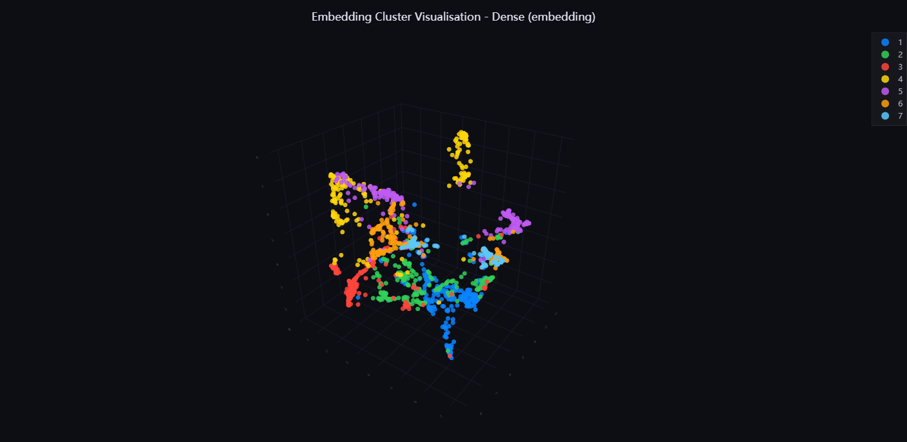
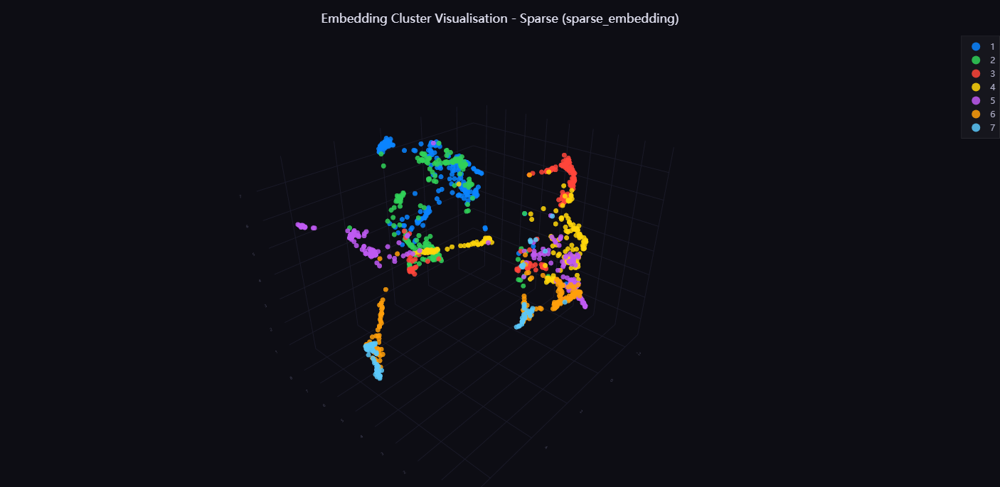
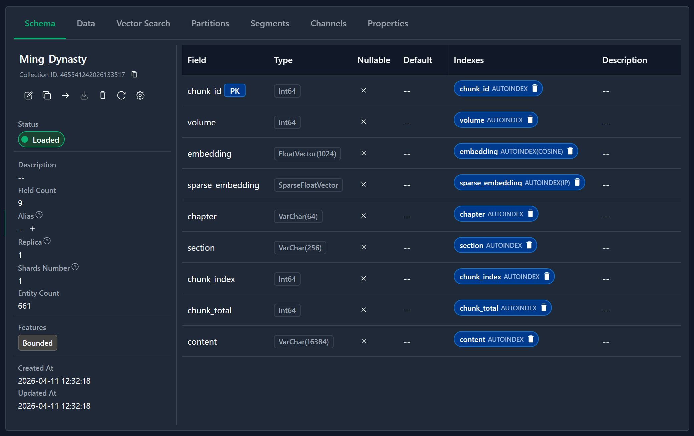
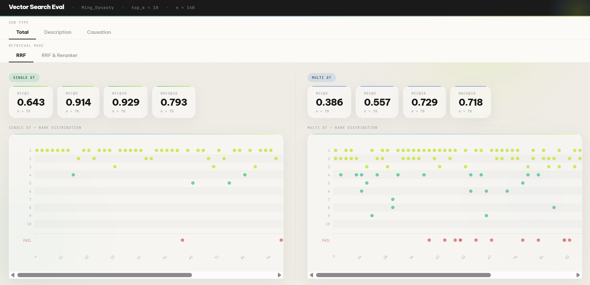
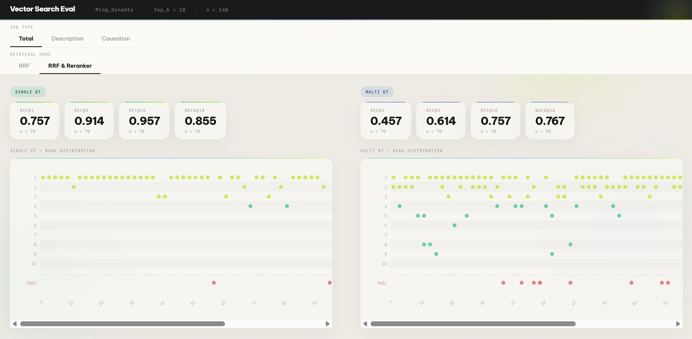
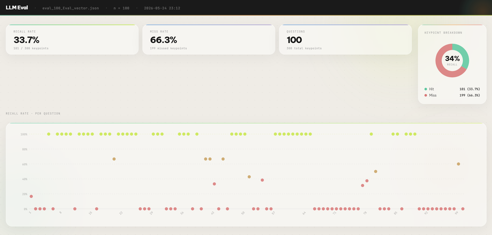
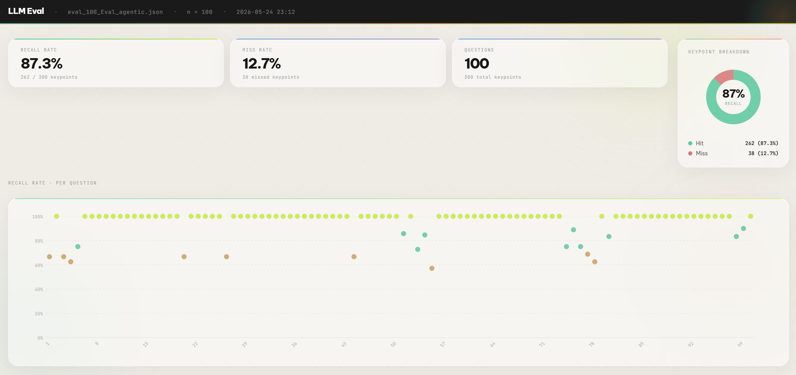
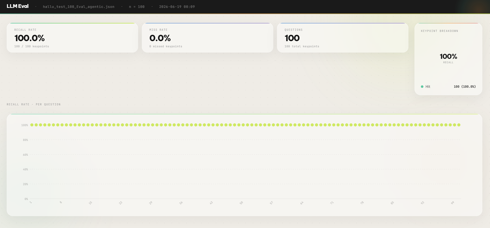

## **Mingchao Agentic RAG  项目**

本文档是项目的完整技术介绍，覆盖从数据准备到评测验收的全流程。项目包含以下几个板块：

- **数据预处理管线**： PDF 原文前三卷按章节两级切分，再经 BGE-M3 编码为稠密向量和稀疏向量，产出带向量的 JSON 语料
- **向量库建立**： 支持 Milvus Lite（本地文件，默认，首次启动自动初始化）和 Docker Milvus 两种模式，Docker 模式需手动执行 notebook 导入 JSON
- **知识图谱构建** ：项目预建了人物关系图谱和时间线事件图谱两份结构化 JSON 数据，分别供人物查询和时间线查询工具做结构化检索
- **双模式 RAG**： 提供 Vector 模式（RRF 融合召回加重排，轻量直查）和 Agentic 模式（LangGraph 智能体推理）两套入口，按需切换
- **意图识别（Query Understanding）**： 将用户问题分类为六种意图类型，输出结构化查询计划，决定后续走哪条检索路径
- **知识图谱检索 Tools**： 人物类问题和时间线类问题各有专属检索工具，检索置信度不足时自动退回原文 chunk 搜索兜底
- **多任务编排器（Orchestrator）**： 针对复合型问题，将其拆解为多个子任务，按依赖关系调度并行执行，最后合并结果
- **Harness Engineering 设计**： LLM 只负责理解和决策，输出格式、参数枚举、校验重试这些能写成规则的部分全部交给代码兜底
- **Agentic RAG 测评体系**： 涵盖 chunk 检索准确率评测（Recall + NDCG）、智能体回答批量生成、LLM 自动打分，以及幻觉测试（注入出自《明朝那些事儿》后半部分的问题验证模型是否会根据先验知识进行回答）

> [!TIP]
>
> **建议配合 [`Agentic_RAG_Test.ipynb`](Agentic_RAG_Test.ipynb) 阅读，里面有还原以上所有模块的测试源代码。**

**[Mingchao Agentic RAG  项目](#mingchao-agentic-rag-项目)**

**[1. 数据预处理管线](#1-数据预处理管线)**

- [i. Recursive PDF 切分](#i-recursive-pdf-切分)
- [ii. Vectorization](#ii-vectorization)
- [iii. 踩坑1：卷级层次切分实验](#iii-踩坑1卷级层次切分实验)

**[2. 向量库建立](#2-向量库建立)**
- [i. Docker 模式建库](#i-docker-模式建库)
- [ii. 为什么选 Milvus](#ii-为什么选-milvus)

**[3. 知识图谱构建](#3-知识图谱构建)**
- [i. 图谱 schema 设计](#i-图谱-schema-设计)
- [ii. 分批提取与增量写盘](#ii-分批提取与增量写盘)
- [iii. 踩坑2：知识图谱的合并策略](#iii-踩坑2知识图谱的合并策略)

**[4. 双模式 RAG](#4-双模式-rag)**
- [i. Vector 模式](#i-vector-模式)
- [ii. Agentic 模式](#ii-agentic-模式)

**[5. 意图识别（Query Understanding）](#5-意图识别query-understanding)**
- [i. 六大问题类型](#i-六大问题类型)
- [ii. query plan 真实示例](#ii-query-plan-真实示例)
- [iii. 踩坑3：chunk 兜底与三路取舍](#iii-踩坑3chunk-兜底与三路取舍)
- [iv. 踩坑4：意图识别纳入原文向量搜索](#iv-踩坑4意图识别纳入原文向量搜索)
- [v. 代码层校验与重试](#v-代码层校验与重试)

**[6. 知识图谱检索 Tools](#6-知识图谱检索-tools)**
- [i. 人物检索工具](#i-人物检索工具)
- [ii. 时间线检索工具](#ii-时间线检索工具)
- [iii. query_kind 决定检索策略](#iii-query_kind-决定检索策略)
- [iv. 踩坑5：工具参数粒度过细导致召回失败](#iv-踩坑5工具参数粒度过细导致召回失败)
- [v. 踩坑6：LLM 可能会根据先验知识填写参数](#v-踩坑6llm-可能会根据先验知识填写参数)
- [vi. 踩坑7：ReAct循环里 LLM 的工具调用方式](#vi-踩坑7react循环里-llm-的工具调用方式)
- [vii. 召回溯源设计](#vii-召回溯源设计)

**[7. 多任务编排器（Orchestrator）](#7-多任务编排器orchestrator)**
- [i. 并行扇出（无依赖任务并发）](#i-并行扇出无依赖任务并发)
- [ii. 顺序依赖（解引用与枚举增生）](#ii-顺序依赖解引用与枚举增生)

**[8. Harness Engineering 设计](#8-harness-engineering-设计)**
- [i. 意图识别节点：JSON 格式校验与重试](#i-意图识别节点json-格式校验与重试)
- [ii. 知识图谱检索工具：参数枚举校验](#ii-知识图谱检索工具参数枚举校验)
- [iii. 引用锚点的运行时校验](#iii-引用锚点的运行时校验)
- [iv. native tool call 未触发时的文本降级解析](#iv-native-tool-call-未触发时的文本降级解析)
- [v. 为什么手写工具执行，不用 ToolNode](#v-为什么手写工具执行不用-toolnode)

**[9. RAG 测评体系](#9-rag-测评体系)**
- [i. 出题设计](#i-出题设计)
- [ii. 出题自检：把质量变成机器可验证的硬门槛](#ii-出题自检把质量变成机器可验证的硬门槛)
- [iii. Vector mode: 量化指标评估](#iii-vector-mode-量化指标评估)
- [iv. Agentic mode: 外部 LLM 评估](#iv-agentic-mode-外部-llm-评估)
- [v. Vector mode 测试报告](#v-vector-mode-测试报告)
- [vi. 最终评估：Agentic vs Vector](#vi-最终评估agentic-vs-vector)
- [vii. 幻觉测试](#vii-幻觉测试)

**[10. 局限性与未来方向](#10-局限性与未来方向)**
- [i. Agent 轨迹评估：能做，但成本陡增](#i-agent-轨迹评估能做但成本陡增)
- [ii. Skill 文本能定规则，但拦不住语义层面的判断失误](#ii-skill-文本能定规则但拦不住语义层面的判断失误)
- [iii. 知识图谱构建与维护是半人工流程](#iii-知识图谱构建与维护是半人工流程)
- [iv. 高并发场景下，GPU 编码这一步会成为瓶颈](#iv-高并发场景下gpu-编码这一步会成为瓶颈)

---


## **1. 数据预处理管线**

> [!NOTE]
> [`data/raw/`](data/raw/) 下已随项目提供向量化语料，正常运行 RAG 系统无需重跑本节。只有替换语料或修改切分参数时才需要执行。


### i. Recursive PDF 切分

`Two_Level_Slice` 把分卷 PDF 处理成检索用的 chunk JSON，两级完成。（对应 notebook **`## PDF Slicing`**）

- **第一级**按原书结构切，遇到 `第X章` 标题就开新章，遇到 `【小节名称】` 就切一个小节出来，每块内容就是原书那一段，不管多长。
- **第二级**负责把太长的块控制在 1000 token 以内。比如某个记载朱元璋登基的小节原文写了 3000 字，就从句尾标点处递归地切开，切成若干块。但切的地方不会硬断，每块结尾的最后几句话会原样复制到下一块的开头（50 token 的 overlap），防止一段叙述恰好被切断、两块都看不到完整上下文。tokenizer 用 Qwen 官方词表，和生成端模型一致，这样量出来的 token 数才有意义。

1000 token 这个上限是经验值。BGE-M3 的最大输入是 8192 token，上限远高于此，但 chunk 太长会让检索结果里塞进大量无关内容，LLM 反而容易被干扰。1000 token 大约对应几段连续叙述，足够包含一个完整的情节单元，也不会太冗余。


### ii. Vectorization

`Vectorization` 对切分好的 chunk JSON 做向量编码，用 **BGE-M3** 对 `content` 字段同时生成 **dense 向量**和 **sparse 词法权重**，分两步串行写出，产出的 `data/raw/mingchao_vectorized.json` 是 Milvus 建库的唯一输入。（对应 notebook **`## Vectorization`**）

选 BGE-M3 的核心原因是它**一个模型同时出 Dense / Sparse 两路向量**。dense 向量捕捉语义，问“朱元璋怎么夺的天下”能找到语义相关的段落。sparse 向量捕捉关键词权重，对人名、年号、地名这类精确词更友好。两路向量用 **RRF** 融合后再过 **Reranker** 精排，比单独用任何一路都强。

其他候选均有明显短板。OpenAI 的 ada-002 只有 dense，text2vec 系列对汉语效果相对没那么好。**BM25** 只有关键词没有语义，且在中文上还需要先分词。BGE-M3 的 sparse 向量在这个场景下**可以直接替代 BM25，效果持平甚至更好**。

BM25 的稀疏权重是纯统计量，靠词频和逆文档频率，词义是什么它完全不知道。问“天子的功绩”，BM25 只认“天子”这个词，chunk 里写的是“皇帝”就匹配不上。BGE-M3 的 sparse 权重是训练出来的，**模型学会了“天子”和“皇帝”在检索上等价，不需要完全字面命中。**此外 BGE-M3 从 subword 层面处理中文，没有分词这个额外的麻烦。


### iii. 踩坑1：卷级层次切分实验

最初我尝试过在 chunk 之上再加一层卷级过滤，思路是先判断问题属于哪一卷，缩小检索范围后再在卷内找 chunk，理论上能提升精度。为此做了七卷 chunk 的 embedding 降维可视化**（使用 UMAP 流形降维）**，按卷着色，验证各卷在向量空间里是否有足够的分离度。

**Dense embedding 可视化**



**Sparse embedding 可视化**



降维后可以看到各卷有一定的聚集趋势，sparse 的卷间分离比 dense 略好，但中心区域各卷有一定混叠，不存在清晰的卷边界。

**更致命的问题是语料本身的跨卷引用**。朱元璋的故事主体在第一卷，但后续各卷还是会频繁提到他，相关 chunk 的向量在语义上高度相似。如果卷级分类把答案所在的那一卷判错了，后续 chunk 检索就会在错误的卷里找，结果完全不对。

因此最终放弃了卷级层次，改为所有 chunk 扁平化后直接做向量相似度检索。卷号作为 metadata 保留在 chunk 字段里，供人工排查用，但不参与检索过滤。对于这种数据量中等、跨卷引用频繁的语料，扁平检索反而是更稳的选择。

交互式可视化文件：

- [`output/embedding_viusal/明朝那些事儿_dense_visual.html`](output/embedding_viusal/明朝那些事儿_dense_visual.html)
- [`output/embedding_viusal/明朝那些事儿_sparse_visual.html`](output/embedding_viusal/明朝那些事儿_sparse_visual.html)


---


## **2. 向量库建立**

项目支持两种 Milvus 部署模式，通过 [`rag/config/settings.py`](rag/config/settings.py) 里的 `MILVUS_MODE` 切换。

**Milvus Lite**（默认）是嵌入式模式，数据存在本地 `.db` 文件里，无需任何额外服务，第一次运行 `python app.py` 时自动建库写入，后续启动直接加载。

**Docker Milvus** 是独立服务模式，承载量可达十亿级向量，支持多客户端并发，适合生产部署。这个项目只有 661 条 chunk，两种模式性能差异感知不到，Lite 足够用。


### i. Docker 模式建库

Lite 模式下数据在启动时自动写入，Docker 模式需要手动执行这一步，对应 notebook **`## Insert json into Milvus Collection`**。

函数负责三件事：连接 Docker Milvus，根据 schema 文件（[`data/Ming_Dynasty.json`](data/Ming_Dynasty.json)）创建 collection，然后把向量化语料批量写入。

schema 文件定义了所有字段的类型和索引配置，包括 dense 向量字段（`embedding`，1024 维，COSINE 度量，AUTOINDEX 索引）和 sparse 向量字段（`sparse_embedding`，SPARSE_INVERTED_INDEX 索引）。

插入完成后可以用 **Attu**（Milvus 官方 GUI）连接本地 Docker 实例，在 Schema 面板里确认所有字段和索引是否就位：




### ii. 为什么选 Milvus

**Chroma** 轻量，适合快速原型，但不适合生产，没有持久化分布式方案，过滤和索引能力有限，文档和生态也相对薄。**Qdrant** 是更现代的竞品，Rust 实现，性能不错，但生态成熟度和社区规模不如 Milvus，踩到边缘 case 时资料明显更少。

Milvus 由 Zilliz 主导开发，在工业界落地案例最多，遇到问题更容易找到参考。同时它的索引选项最丰富（HNSW、IVF、DiskANN 等），稀疏向量和混合检索的支持也是最成熟的。对于这个项目来说，选 Milvus 不只是因为够用，也是为了我能积累在生产级向量数据库上的实际经验。


---


## **3. 知识图谱构建**

向量检索擅长找语义上接近的段落，但对枚举型和统计型问题力不从心。比如 “明朝一共被外族入侵了多少次，分别发生在哪年” 这类问题，**答案散落在几十个 chunk 里，top-k 召回根本拿不全**，就算把 k 扩大到几十，**LLM 上下文也会被大量无关内容稀释**，真正有用的细节反而容易丢失。人物类问题也有同样的困境，“跟朱元璋有直接关系的武将有哪些” **需要系统性地扫描整本书的人物关系**，chunk 检索只能按语义相似度命中，覆盖面没有保证。

知识图谱把这类信息从原文中提取出来，整理成结构化 JSON，检索模式从“相似度查找”变成“精确过滤 + 正则匹配”，枚举类和统计类问题就能靠工具直接查，不再依赖向量召回。[`mingchao_people.json`](data/people_timeline/mingchao_people.json) 和 [`mingchao_timeline.json`](data/people_timeline/mingchao_timeline.json) 由三个 Claude Code skill 协同构建：

- [`skills/mingchao_people_timeline_builder/`](skills/mingchao_people_timeline_builder/) 按 chunk 范围分批抽取，增量写盘
- [`skills/mingchao_people_timeline_merger/`](skills/mingchao_people_timeline_merger/) 把多个分批产物合并成单卷最终 JSON
- [`skills/mingchao_people_timeline_complier/`](skills/mingchao_people_timeline_complier/) 把单卷 JSON 合并进跨卷积累大 JSON


### i. 图谱 schema 设计

人物和时间线的字段分两类，这是整个检索系统的核心设计。

**人物图谱**（[`mingchao_people.json`](data/people_timeline/mingchao_people.json)）里只有两个字段有规范化约束。`primary_identity` 是 13 值固定枚举，涵盖皇帝、藩王、武将、文臣、宦官、宗室、后妃、方士、商人、起义军首领、外族首领、僧道、文人。`era` 是年号字段，值同样被约束在已知年号范围内。这两个字段专门用于**精确过滤**，比如查“洪武年间的武将”，先把 `era == "洪武"` 且 `primary_identity == "武将"` 的条目锁出来，再在命中集里找答案。固定枚举保证了 LLM 在不同批次里用词一致，不会一次写“文臣”一次写“文官”导致条件匹配漏掉。其余的 `roles`、`relationships`、`events`、`summary` 均为 LLM 自由生成，用于**正则模糊命中**，比如在 `relationships` 里正则搜“蓝玉”，找出所有跟蓝玉有记录关系的人物。

**时间线图谱**（[`mingchao_timeline.json`](data/people_timeline/mingchao_timeline.json)）没有固定枚举字段，但 `year` 是整数类型，可以做精确年份查询和范围过滤，比如“1380 年到 1400 年之间发生了哪些事”直接用数值比较就能锁定范围。`era` 是 LLM 填写的年号文本，`tags` 是 LLM 自由写的标签数组（比如“起义”、“人物节点”），`event`、`location`、`participants`、`outcome`、`summary` 全部是自由生成，供正则搜索匹配。


> **幻觉预防**

`source_chunks` 记录的是该事件从哪些 chunk 里提取出来的，用于溯源，不参与检索。等知识图谱构建完毕后会让 agent 根据source chunk 对知识图谱内容做自检，**防止 agent 在编写知识图谱的过程中将自己的先验知识也填写进去**，哪怕是书中完全没出现的内容。


### ii. 分批提取与增量写盘

（[`skills/mingchao_people_timeline_builder/`](skills/mingchao_people_timeline_builder/)）

**builder** 负责从指定 chunk 范围内提取人物和事件条目，每批处理 20 个 chunk，逐批完成后立刻**增量写盘**避免进度丢失，并用 `validate_kg.py` 做结构自检，通过了才继续下一批。这个节奏能把错误锁定在单批级别，不会一口气跑完发现问题全堆在一起。

每个人物的收录门槛是在该 chunk 范围内有 2 个以上 chunk 对其有实质描述，一两处路过式提及不算。批次之间，同一人物的 summary 只覆盖本批时段，暂时用 `[PART]` 标记串联各段，留到最后一步统一重写成跨全范围的连贯叙事。

这套 skills 不光是纯文本约束，还引入了**辅助脚本**来控制 agent 处理的信息量。每次提取时，脚本负责按 chunk ID 把原文取出来，只给 agent 看纯文本，元数据一律不传。合并时，所有去重和字段拼接的机械工作也由脚本完成，agent 收到的只是一行摘要（新增多少、更新多少），不用在上下文里消化整份 JSON。

校验脚本做三层检查。第一层是结构完整性，所有必填字段都得有。第二层是字段格式，比如年号字段不能填“早年”“明初”这种描述词，必须是正式年号；关系描述不能少于 12 字且不允许出现“同为文臣”这类没有信息量的表述。事件结果不能少于 15 字且不允许出现“影响深远”这类没有信息熵的话。第三层是**两份 JSON 的交叉引用一致性**，人物档案里列出的每个事件名必须在时间线里有对应条目，时间线里列出的每个参与者必须在人物档案里有对应条目，两份文件互相锁住，任何一边有悬空引用都会被拦住。


### iii. 踩坑2：知识图谱的合并策略

（[`skills/mingchao_people_timeline_merger/`](skills/mingchao_people_timeline_merger/) · [`skills/mingchao_people_timeline_complier/`](skills/mingchao_people_timeline_complier/)）

最初我的想法很直接，builder 分批提取，各批产出的 JSON 直接合并就好了。可问题随即出现。朱棣在靖难之役前是燕王，LLM 提取到的 `primary_identity` 是“皇室”（藩王），靖难成功后他是永乐皇帝，`primary_identity` 应该是“皇帝”。两个批次各自只看到他生命的一段，给出了不同的枚举值，直接合并会产生矛盾字段。

针对**批次内合并**，做了专门的跨批合并工具，核心是把“字段合并”和“summary 改写”拆成两个明确分开的阶段。第一阶段只做机械操作，**同一人的多段 summary 用 `[PART]` 串联（用来作为将来会合并的标记）**，非 summary 字段做集合并，一个字都不改写。第二阶段等所有字段都合并完毕后，统一扫描含 `[PART]` 的 summary，LLM 此时已经能看到这个人物在全书的所有信息，重新写一份覆盖全时段的连贯叙事，消除 `[PART]`。两步分开的意义是改写时信息已经完整，不会因为只看到了前几批而写出片面的 summary。工具还会预先用脚本把所有条目分成 **passthrough**（只在单个文件里出现）和 **merge**（在多个文件里都有），大部分次要人物走 passthrough 路径完全跳过 LLM，省 token 也省时间。

脚本层面有两个设计值得说。**合并启动前先跑一轮预冲突扫描，把所有批次文件过一遍，找出同一人物在不同批次里固定字段有冲突的情况，发现就停下来让用户先裁决，不让 LLM 在有歧义的前提下开始工作。**进入实际合并时，脚本会把同一人物在所有批次里的全部版本提取出来，打包成一份材料给 LLM，让它能一次性看到全貌再决策，而不是一个批次一个批次地喂。每批处理的条目数有上限（人物 3 个，事件 5 个），防止单次上下文过大。

针对**跨卷合并**，还有一个工具负责把新提取的单卷 KG 合并进已积累的跨卷大 JSON。判断两个条目是否为同一个人，脚本按优先级依次尝试多种匹配方式，从精确名字命中，到互查别名列表，再到名字模糊相似度，逐级退而求其次。没有候选的新条目直接加入，找到候选的则整理成结构化任务清单给 LLM 判断，每道题里新旧两份记录并排呈现，LLM 能直接对比作决策，不用自己在大 JSON 里翻找。**遇到无法自动裁定的冲突情况（比如朱棣的 primary identity 到底算藩王还是皇帝），流程停下来向用户提问，不自作主张猜测**。合并写出前先暂存到临时文件，验证通过再提升为正式文件，保证源文件绝对不被污染。


---


## **4. 双模式 RAG**

系统对外提供两套检索入口，通过参数切换。Vector 模式是一条纯代码的快速通道，Agentic 模式是带 LLM 规划的智能体通道。两者用同一套底层数据，区别在于要不要让 LLM 参与决策。（对应 notebook **`## Agentic RAG`**）


### i. Vector 模式（Dense/Sparse双路融合+Reranker）

Vector 模式是一条**纯检索路径，全程没有 LLM 调用，也不带对话历史，适合快问快答**。拿到用户问题后，直接在原文 chunk 上跑检索，dense 向量走 BGE-M3 加 HNSW/COSINE，sparse 向量走 BGE-M3 词法权重加内积，两路结果用 **RRF** 融合，再过 **Reranker** 精排，返回前 10 个 chunk。

这条路完全不碰意图识别、人物工具、时间线工具和最终推理 agent。它的价值在于快和省，一次问答零 LLM 成本，毫秒级返回。对于“书里某段话怎么写的”这种直接召回原文就能解决的问题，Vector 模式足够用，也方便用来对照 Agentic 模式的检索质量。

两条检索路径用的是不同的索引结构，各自匹配向量的数据形态。

**Dense 向量 1024 维全满，每个维度都有数值，向量之间的距离远近是有意义的概念，所以用HNSW**，它是图结构的近似最近邻索引，建图时每个向量节点连向最近的若干邻居，查询时从入口节点出发沿边跳跃逼近答案。搜索参数 `ef=64` 控制查询时维护的候选队列大小，值越大召回越好但稍慢，64 是精度和速度都不需要纠结的值。建图参数 M 和 efConstruction 由 Milvus AUTOINDEX 自动管理，没有手动设置。

**Sparse 向量绝大多数维度是 0，只有命中的 token 对应的维度有权重值，所以用倒排索引加内积**。对这种数据跑 HNSW 没有意义，因为大多数向量对之间距离都没有区分度。倒排索引只存非零维度，查询时取出问题里每个 token 对应的候选列表，按内积加权求和排序，完全跳过那些值为 0 的维度。这和传统 BM25 的倒排思路一脉相承，区别是权重不再是纯统计的 TF-IDF，而是 BGE-M3 训练出来的语义权重。

不过说实话，这个量级下（661 条 chunk）两种索引的速度优势都体现不出来，**暴力枚举全量内积也是毫秒级，三种方式感知不到区别。**选 HNSW 加 `SPARSE_INVERTED_INDEX` 是生产环境的标准配置，语料规模扩大时不需要改索引，直接兼容。

**RRF（Reciprocal Rank Fusion）具体怎么融合两路结果**，逻辑全在 [`chunk_rrf.py:306-345`](rag/retrieval/chunk_rrf.py#L306-L345) 的 `_RRF_Core` 里。dense 和 sparse 各自先跑出 `CHUNK_CANDIDATES = 30` 条候选（[`settings.py:60`](rag/config/settings.py#L60)），每条候选在自己这一路里有一个排名（第几名命中），RRF 不看 dense 和 sparse 各自的相似度数值（两路的分数根本不是一个量级，没法直接比），只看排名，公式是

$$
\text{score}(d) = \sum_i \frac{1}{k + \text{rank}_i(d)}
$$

`k` 取 `RRF_K = 60`（[`settings.py:61`](rag/config/settings.py#L61)）。

举个例子，chunk_A 在 dense 路排第 1，在 sparse 路排第 3，chunk_B 在 dense 路没出现（只在 sparse 路排第 1），那 chunk_A 的分数是

$$
\frac{1}{60+1} + \frac{1}{60+3} = 0.01639 + 0.01587 = 0.03226
$$

chunk_B 因为只在一路出现，缺的那一路按未命中处理（代码里给一个极大值兜底，等于这一路贡献几乎是 0），分数约等于 `1/(60+1) = 0.01639`。两路都靠前的 chunk_A 分数明显更高，最终按这个分数降序排，取前 30 条（`CHUNK_CANDIDATES`）交给 reranker 精排。

`k = 60` 这个值是 RRF 这个方法本身论文里给的默认参数，项目里基本没动过，没有针对这批语料专门调过。`k` 加在分母里相当于给排名做了平移，`k` 越大，越是把"具体排第几"这件事的影响磨平：

- `k` 取很小的值时，排名第 1 和第 2 之间分数差得很大，融合结果会对某一路偶然的名次波动很敏感。
- `k` 取 60 之后，排名第 1 和第 2 之间分数只差大约 0.00026，几乎可以忽略，融合结果只看"大致排在前面还是后面"，更不容易被某一路的噪声带偏。


**`SPARSE_DROP_RATIO = 0.2`，作用在 sparse 检索这一步。** BGE-M3 的 sparse 向量本质是给问题里每个词打权重，比如问"朱元璋的开国功臣有哪些"，编码出来"朱元璋"权重 0.9、"开国"权重 0.6、"功臣"权重 0.5，"的"、"有"、"哪些"这类虚词权重很低，比如 0.02、0.01、0.03。[`chunk_rrf.py:373`](rag/retrieval/chunk_rrf.py#L373) 把这个值传给 Milvus 的 `drop_ratio_search`，规则是权重低于本次查询最高权重 × 0.2 的词直接不参与搜索。这个例子里最高权重 0.9，0.9×0.2=0.18，权重低于 0.18 的虚词被跳过，Milvus 只拿"朱元璋""开国""功臣"三个真正有信息量的词去匹配索引，省掉没用的查询开销。


> **兜底设计**

Dense/sparse 检索加 RRF 融合这几步本质是排序，不是判断"有没有相关内容"，corpus 里再不相关的内容也会被排出一个顺序，区别只是分数高低。[`chunk_rrf.py:395-401`](rag/retrieval/chunk_rrf.py#L395-L401) 在 reranker 给每条候选打完真实相关性分（归一化到 0~1）并排好序后，检查排第一的分数是否低于 0.05。如果用户问的内容压根不在前三卷原文里，dense/sparse 阶段照样会排出 top-10（必须返回点东西），但 reranker 给出的真实分数会很低，比如 0.02，这条判定成立后直接返回空列表，而不是把几条不相关的内容硬凑成答案。空列表回到上游会被当成"没有 chunk 证据"，最终走"根据现有资料，无法回答"，不会强行编一个不相关的答案。


### ii. Agentic 模式

Agentic 模式用受控的 LLM 规划加并行证据检索来处理复杂问题。拿到用户问题后，先进意图识别节点输出一份结构化查询计划，再进编排器，单任务直接下发，多任务则按依赖图调度并行执行。每个需要检索的子任务都会同时跑结构化检索（人物库或时间线库）和原文 chunk 检索两路，结果汇总后交给证据判断环节衡量是否充分，最后才生成带引用的答案。

这套链路是为了应对 Vector 模式搞不定的问题，比如“于谦参与了哪些大事、和谁有关联、书里怎么评价他”这种一个问题套着多个信息槽的复合查询。单靠一次向量召回拿不全，必须先把问题拆开，分别检索再合并。**意图识别节点就是这条链路的第一站，它决定后面每个子任务往哪走，下面的 Section 正式开始对其进行介绍。**


---


## **5. 意图识别（Query Understanding）**

意图识别是整个 Agentic 链路的第一站，也是最核心的设计。**它的核心职责是首先将用户的问题根据对话历史（如果有）进行指代还原**，例如：

> 上一轮问的是“朱棣发动靖难之役的导火索是什么”，下一轮问“那他最终是怎么攻入南京的”，“他”还原为“朱棣”，问题改写为“朱棣最终是怎么攻入南京的”。

**然后对指代还原后的问题进行以下三类的 intention 判断**：

- `people`：人物关系、身份、别名、从事件出发找人——走人物知识库精确检索
- `timeline`：时间点、时间段、先后顺序、持续时长——走时间线知识库精确检索
- `direct`：感叹、评论、闲聊，不需要检索——LLM 直接回复

> [!TIP]
>
> **我刻意没有让它规划具体的检索参数，LLM 所有的精力必须放在 “读懂这个问题想问什么” 上**。检索参数等到问题路由到对应的人物或时间线规划节点之后再生成，这样意图识别只需要专注理解，规划只需要专注检索，两边职责互不干扰边界清晰。


**最终输出一份结构化的 query_plan JSON**，包含以下字段：

- `refined_query`：指代还原后的完整问题
- `task_type`：`single`（单问）或 `subtasks`（复合问需要拆分）
- `tasks`：子任务列表，每个任务包含
  - `task_id`：编号，从 t1 开始（如果是单问就只有 t1）
  - `task`：子任务文本，严禁改写
  - `query_kind`（期望回答类型）：`fact`（单一确定值）/ `multi_enum`（并列/枚举多项）/ `analysis`（推理解释）
  - `intention`：`people` / `timeline` / `direct`
  - `depends_on`：填前置任务编号则**串行等待**，空则与其他子任务**并行执行**

> [!TIP]
>
> **其中对于 `query_kind`** ：把 multi_enum 单独拎出来是一个关键设计，因为枚举型问题最容易出的毛病是漏召回。若回答涉及 People / Timeline 和 chunk 检索这类**多意图多路召回，任意一路单独生成答案都可能不全**。标成 **multi_enum** 之后，**系统会强制等多路都返回，合并成一个结果池再统一判断**，从机制上堵住“只答出一半”的情况。


### i. 六大问题类型

六大问题类型是便于人类理解和归纳的分类框架，**QU 真正输出的 intention 只有三个值，people、timeline、direct，六大类最终都要映射到这三个值上**。其中 3 场景描述和 4 因果分析的路由目标写的是原文 chunk，但 intention 里并没有 chunk 这个值，这是一个刻意为之的设计，原因留到 [`踩坑3`](#iii-踩坑3chunk-兜底与三路取舍) 细说。

| 类型 | 问题特征 | 路由目标 | 例子 |
|---|---|---|---|
| **1 实体关系** | 谁是 X、X 和 Y 什么关系、哪些人满足某身份 | People | 黑衣宰相是谁？ |
| **2 时序事件** | X 发生在哪年、哪年有什么事、谁先谁后 | TImeline | 鄱阳湖之战发生在哪一年？ |
| **3 场景描述** | 当时具体发生了什么、书里原话怎么写 | 原文 chunk | 道衍具体是做什么向朱棣暗示可以称帝的？ |
| **4 因果分析** | 为什么、有什么影响、作者怎么评价 | 原文 chunk | 朱元璋为什么要废除丞相制度？ |
| **5 子任务拆分** | 一个问题里套了多个信息槽，或前后存在依赖，枚举等 | 编排器 | 明朝洪武有几大案件？里面涉及的主要人物以及结局分别是什么？ |
| **6 闲聊感叹** | 感叹、评论、不需要检索的闲聊 | 直接 LLM 回复 | 朱元璋也太厉害了！ |


> **1 实体关系（people）**，从已知锚点出发找人或找关系。

| 子类 | 例子 |
|---|---|
| **别名/称号 → 本名** | 黑衣宰相是谁？ |
| **人物关系** | 朱棣是朱元璋的第几个儿子？ |
| **事件 → 人物** | 送给朱棣那顶白帽子的人是谁？ |
| **身份筛选** | 明朝有哪些太监专权？ |

> **2 时序事件（timeline）**，围绕时间点、先后顺序、时间段展开。

| 子类 | 例子 |
|---|---|
| **事件 → 时间** | 鄱阳湖之战发生在哪一年？ |
| **时间 → 事件** | 永乐三年有哪些重要事件？ |
| **先后比较** | 陈友谅和张士诚谁先被消灭？ |
| **持续时长** | 靖难之役打了多少年？ |

> **3 场景描述（chunk）**，原文里的具体细节，结构化库只有概括，答不了。

| 子类 | 例子 |
|---|---|
| **具体行为/对话** | 道衍是怎么向朱棣暗示可以称帝的？ |
| **事件转折/决定性细节** | 鄱阳湖之战的决定性转折是什么？ |
| **人物言论/原话** | 朱元璋说过哪句话概括了他的用人哲学？ |
| **外貌/细节描写** | 书中是如何描述朱元璋长相的？ |

> **4 因果分析（chunk）**，找的是议论分析段落，往往跨多个 chunk。

| 子类 | 例子 |
|---|---|
| **原因** | 朱元璋为什么要废除丞相制度？ |
| **历史影响** | 靖难之役对明朝政治格局产生了什么影响？ |
| **作者评价** | 书中如何评价袁崇焕这个人？ |
| **比较性分析** | 朱元璋和朱棣在治国风格上有什么根本区别？ |

> **5 子任务拆分（编排器）**，按子任务之间有没有依赖分成两组。

| 子类 | 例子 |
|---|---|
| **并行** | 于谦参与了哪些大事、与哪些人有关联、书中如何评价他？ |
| **顺序依赖** | 永乐年间最重要的几件大事在何时发生、各自涉及哪些核心人物？ |

> **6 闲聊感叹（直接回复）**，完全跳过 RAG，LLM 直接回。

| 子类 | 例子 |
|---|---|
| **感叹/评论** | 朱元璋也太厉害了！ |
| **闲聊** | 你觉得朱元璋和刘邦谁更厉害？ |


### ii. query plan 真实示例

> **历史信息：朱棣通过靖难之役当上了皇帝。**
>
> **用户新问题：他在位期间亲征漠北共几次、每次北征的主要对手和结果分别是什么？**

```json
{
  "refined_query": "朱棣在位期间亲征漠北共几次、每次北征的主要对手和对手的下场分别是什么？",
  "task_type": "subtasks",
  "tasks": [
    {
      "task_id": "t1",
      "task": "朱棣在位期间亲征漠北共几次？",
      "query_kind": "fact",
      "intention": "timeline",
      "depends_on": []
    },
    {
      "task_id": "t2",
      "task": "朱棣每次北征的主要对手分别是什么？",
      "query_kind": "multi_enum",
      "intention": "people",
      "depends_on": []
    },
    {
      "task_id": "t3",
      "task": "朱棣每次北征对手的下场分别是什么？",
      "query_kind": "multi_enum",
      "intention": "timeline",
      "depends_on": [t2]
    }
  ]
}
```

- 第一步，指代还原。对话历史里有“朱棣通过靖难之役当上皇帝”，所以**“他”被还原为“朱棣”**，写进 `refined_query`。

- 第二步，子任务拆分。问题里套了三个信息槽，次数、对手、对手的下场，拆成 t1、t2、t3。t1 和 t2 互不依赖，`depends_on` 为空，编排器并行发起。**t3 问的是“每个对手的下场”，要知道对手是谁才能问下场，所以 `depends_on` 填 `[t2]`**，等 t2 结果回来后再串行执行。**所有子任务严禁出现任何代词，必须依旧是指代还原的状态。**

- 第三步，各任务的字段判断。
  - t1 问共几次，答案是一个确定的数字，`query_kind` 填 `fact`，时间类问题走 `timeline`。
  - t2 问每次的对手，“分别”说明是并列多项，漏一个都算错，`query_kind` 填 `multi_enum`，对手是人，走 `people`。
  - t3 问每个对手的下场，同样“分别”并列多项，`multi_enum`，下场属于事件记录，走 `timeline`。


### iii. 踩坑3：chunk 兜底与三路取舍

people 和 timeline 这两条结构化路线的可靠性，建立在知识图谱上。但知识图谱存的是概括性描述，碰到用户查询具体到细节层面的问题就会抓瞎。比如问“道衍是怎么暗示朱棣称帝的？”，知识图谱里只有“道衍暗示朱棣称帝”这种概括条目，根本没有“递上白帽子”这个具体细节。这种问题即便正确地归到了 people 知识图谱也查不到答案。

**解法是每个检索子任务在拿到问题的同时，另开一个子线程并行直接跑 chunk 向量搜索做兜底。**这里有个代码上的巧思，chunk 搜索从一开始就和结构化检索并行跑，等结构化那边确认查不到，立刻取用早就跑好的 chunk 结果，不需要等到发现没答案再回头重跑一遍。压力测试里一百道题大概只有几次真正触发兜底，比例不高，但这几次兜底是实打实会起到作用，并行那点开销完全值得。

那为什么不干脆 people、timeline、chunk 三路全部并发，让 LLM 连选都不用选？**因为实测下来正确率没有任何提升，token 反而消耗更多。**原因是 people 和 timeline 之间的区分本来就很清晰，我又在 prompt 里明确规定，**不管题目看上去多像时序问题，只要它真正想要的答案落在人物上，就必须归 people，反之亦然**，并且附了正反例做对比学习。有了这条约束，分错的情况实测下来几乎见不到。不过这同样建立在 Qwen3.7 的理解能力上，早先用 3.0 或者参数只有30几B的模型测的时候分类就没这么稳。


### iv. 踩坑4：意图识别纳入原文向量搜索

还有一个设计是，**虽然我们现在的查询设计是三路路由（不算Direct：People / Timeline / Chunk），但意图识别只有两大知识图谱的路由（People / Timeline），并没有路由到原文 chunk 向量检索的选择**。

最早其实是有的，六大问题分类的第三（场景描述）和第四（因果分析）这两类答案就会被路由到原文 chunk 向量搜索，绕过知识图谱从而省去工具调用。**但压测下来发现 LLM 频繁误判，把大量本该走 people 或 timeline 的问题分到了 chunk，召回质量大幅下降。**

关键在于**这个误判的代价是不对称的**：

- people 或 timeline 的问题一旦被误判成 chunk，就只剩向量搜索这一路，知识图谱的精确检索彻底丢掉，很可能答错。
- 反过来，场景描述和因果分析这类原本应该走 chunk 的问题，就算被意图识别误判成 people 或 timeline，结构化检索大概率查不到具体细节，但并行跑的 chunk 兜底还在，最终照样能拿到答案。

所以**彻底删掉 chunk 这个 intention 值是合理的取舍**，最差情况也只是多跑一次注定失败的结构化搜索，信息一点不丢。少给一个选项，就少一个填错的机会。


### v. 代码层校验与重试

意图识别的输出不是 LLM 说了算，而是要过一道**代码校验**。LLM 用 JSON 模式输出后，代码会逐条检查格式，比如 task_type 只能是两个值之一、任务编号必须从 t1 开始连续不跳号、意图和答案性质必须在合法枚举里、依赖引用的任务号必须真实存在且排在前面。任何一条不合格，就把具体的错误描述返回给同一个 LLM 让它重新输出，最多重试两次。

这个设计的核心是**把“格式正确”这件事交给代码硬性把关，这种确定性的东西责任边界划归代码永远是最保险的设计**，而不是指望输出经常漂移的 LLM prompt 里写一句“请严格按格式输出”就万事大吉。


---


## **6. 知识图谱检索 Tools**

意图识别把问题路由到 people 或 timeline 之后，就进入对应的结构化检索节点。意图识别只负责“这道题该走哪条线”，到了检索节点才真正去填检索参数。这一步同样交给 LLM 做，但它的任务很窄，就是读懂 task，从两个知识图谱工具里挑一个，把参数填对。对应的 prompt 是 [`people_plan.md`](rag/agent/skills/people_plan.md) 和 [`timeline_plan.md`](rag/agent/skills/timeline_plan.md)。


### i. 人物检索工具

人物线有两个工具，**挑哪个只看一件事，task 里有没有出现具体人名，问的是不是这个人的关系网**。

| task 的情况 | 用哪个工具 |
|---|---|
| 没有具体人名（只有别名、称号、职衔、身份、时代这类描述符），或已知人名但只查这个人本人的档案 | `people_search` |
| 已知人名 X，问的是 X 和谁有关联、X 的关系网 | `relationships_search` |


> **`people_search` 三个参数：**

| 参数 | 取值规则 |
|---|---|
| `entities` | 自由列表，从 task 文本里摘出来的人名、别名、职衔关键词，没有固定枚举，**但严禁填 对应子任务里没出现过的词**，无锚点填 `[]` |
| `era_filter` | **固定枚举列表**，只能从“至正、洪武、建文、永乐……崇祯”这套年号表里选，LLM 不能自己编年号，无约束填 `null` |
| `primary_filter` | **固定枚举单值**，只能是“皇帝、明朝武将、文臣、宦官、皇室、反叛势力……”这 13 个身份大类之一（对应前面 schema 设计里那个 13 值的 `primary_identity`），识别不到填 `null` |

三者之间是 **AND**，参数内部是列表的话，列表内是 **OR**。拿两个具体问题对比着看：

- 问“**洪武年间**的武将有哪些” → `era_filter=["洪武"]` AND `primary_filter="明朝武将"`，两个条件要同时满足，必须**既是洪武年间的人物，又是武将身份**，取的是交集，不是把洪武年间的人和所有武将都列出来。
- 问“**洪武到永乐年间**的武将有哪些” → `era_filter=["洪武","建文","永乐"]` AND `primary_filter="明朝武将"`，`era_filter` 列表里三个年号是 OR，**只要命中其中任意一个年号就算满足这一层**，三个年号的人凑成一个集合，再跟“武将”这个条件取交集。


> **`relationships_search` ：**

| 参数 | 取值规则 |
|---|---|
| `person` | 必填，自由文本，只能是 task 里出现的人名或别名，定位关系网的主体 |
| `target` | 可选，自由文本或 `null`，只能是 task 里**明确出现过**的人名，填了就只留和这个人相关的关系条目，不填返回全量关系交给 LLM 读 |

问“朱棣和方孝孺是什么关系”就是 `person="朱棣"` + `target="方孝孺"`；问“朱棣手下有哪些武将”就是 `person="朱棣"` + `target=null`，拿全量关系交给 LLM 自己从里面挑。

**这里有个值得注意的点，`person` 和 `target` 到底谁填谁，不是随便选的，背后还藏着一个关于召回质量的考量。**像“朱棣和方孝孺是什么关系”这种两个名字都已知的问题，写成 `person="朱棣"` + `target="方孝孺"`，还是反过来 `person="方孝孺"` + `target="朱棣"`，两边技术上都能查到这条关系，不存在“查不到”的问题，但**查到的信息密度可能完全不一样**。

朱棣这种皇帝级别的人物，relationships 字段下挂着的关联人能有几十个，LLM 建立的知识图谱对细枝末节的小人物信息量会偏简略。反过来，如果对方是个不起眼的小人物，比如一个曾经给皇帝占卜过的方士，他名下记录的关系本来就少，但凡留下一条，往往就是这唯一一次重要互动，描述反而会比皇帝那边详细、指向性也更强。所以两个已知人名都能选的时候，**优先把信息更具体、关系更少的那个填进 `person`**，召回的那条记录更可能直接命中，信息量也更大。

但只有一个已知人名时就不能这么随意了。举个例子，问“用假接应牵着陈友谅走的人是哪位？”，这句话里唯一出现的人名是“陈友谅”，**但他在问题里只是被牵着走的那个，是宾语，真正要找的答案是另一个还没出现名字的人**。这种时候铁律是，已知的那个名字“陈友谅”必须填进 `person`，`target` 留 `null`，也就是 `relationships_search(person="陈友谅", target=null)`，这样系统会把陈友谅名下的全量关系列表整个吐出来，再让 LLM 在这一整份列表里扫描，找到那条“用假接应牵着他走”的记录，答案自然就在这条记录的对方身上。

绝不能反过来想，既然问的是“谁牵着陈友谅”，就把“陈友谅”塞进 `target`、`person` 留空或者瞎填一个猜测的名字。原因很直接，`person` 才是真正拿去做姓名匹配、定位记录的字段，`target` 只是在已经定位到的那份关系列表里再做一次筛选，**离开 `person` 单靠 `target` 根本找不到任何记录**，`person` 留空这个调用直接就是无效的。所以只要 task 里出现的这个人名是“被影响的一方”而不是“确定的答案”，都要老老实实填进 `person`。


### ii. 时间线检索工具

时间线只有一个工具 `event_search`，四个参数。

| 参数 | 取值规则 |
|---|---|
| `event_keywords` | 自由列表，事件专名、历史术语，或能当事件锚点的地名，在事件名、标签、地点、结果四个字段做正则匹配；严禁填泛化的动词或描述词（“处置”、“改革”这类词几乎不会原样出现在字段里，填了等于白填），无锚点填 `null` |
| `era` | **固定枚举列表**，只能从“天历、至正、洪武、建文、永乐……崇祯”这套年号表里选，LLM 不能自己编年号，无约束填 `null` |
| `year` | 自由整数列表，**仅当 task 明确写出公元年数字时才填**，命中 `year` 字段的精确值，无公元年填 `null` |
| `participants` | 自由列表，只能是 task 里明确出现过的人名，打参与者字段，无人物锚点填 `null` |

四者之间是 **AND**，参数内部是列表的话，列表内是 **OR**，逻辑和人物工具完全一致。拿两个问题对比着看：

- 问“**洪武年间朱元璋**做了什么大事” → `era=["洪武"]` AND `participants=["朱元璋"]`，两个条件要同时满足，**既要是洪武年间的事，又要朱元璋在场**，取交集，不是把洪武年间的事和朱元璋相关的事全部堆出来。
- 问“**建文至永乐年间**朱棣处置了哪些建文旧臣” → `era=["建文","永乐"]` AND `participants=["朱棣"]`，`era` 列表里两个年号是 OR，**命中其中任意一个年号就算满足这一层**，两个年号的事件先凑成一个集合，再跟“朱棣在场”这个条件取交集。


### iii. query_kind 决定检索策略

同一个工具，`query_kind` 不同，参数填法和判断标准完全不一样。这个字段是意图识别在 query_plan 里就定好的，到检索节点直接拿来用。

| query_kind   | 检索目标       | 策略                                                         |
| ------------ | -------------- | ------------------------------------------------------------ |
| `fact`       | 找一个确定答案 | 精确锚点，AND 收窄，一次到位                                 |
| `analysis`   | 找带叙述的证据 | 拿 `summary`、`relationships[].context`、`outcome` 这些含叙述的字段 |
| `multi_enum` | 找完整集合     | 宽召回，尽量少叠 AND 条件，争取拿全量候选                    |

三种各举一个例子，连填法带判断标准一起看。

- `fact` 找的是一个确定的值。问“鄱阳湖之战发生在哪一年”，`event_keywords=["鄱阳湖之战"]` 一个精确锚点就够，工具返回那条事件记录，从 `year` 字段直接读出年份。判断标准也最干脆，结果里有没有那个确定的值，有就答，没有就转兜底。
- `analysis` 找的不是一个值，而是一段能解释原因、动机或场景的叙述。问“朱元璋为什么要废除丞相制度”，用 `people_search(entities=["朱元璋"])` 把档案拿回来，重点读 `summary` 这种含叙述的字段，timeline 那边对应读 `outcome`。判断标准跟 fact 不一样，光有身份概括（“朱元璋是开国皇帝”）不算数，必须叙述字段里真的有覆盖到“为什么废丞相”的具体说法，否则就转 chunk 兜底去原文里找。
- `multi_enum` 要的是“全”，不是“对一个”。问“永乐年间有哪些大事”，只填 `era=["永乐"]` 宽召回就行，多叠一个 `participants` 反而会把只录了一方的事件漏掉。判断标准是看返回的条目数够不够，明显只回来一两条而问题期望一长串，就要兜底补全。这也呼应前面意图识别那节强调的，**枚举型问题最怕漏召回，所以宁可宽一点。**


### iv. 踩坑5：工具参数粒度过细导致召回失败

人物检索工具一开始不是现在这个样子。最早的版本恨不得把过滤做到极致，除了人名，还想让 LLM 顺手把时代、事件、身份这些维度全填上，参数开得又多又细，想着条件叠得越多，召回的结果就越准越窄。

实践下来这个方向是错的，而且错的方式有点反直觉，**问题往往不是某个参数填错了，而是几个参数即便各自都填对，凑在一起照样可能直接召回失败**。原因就是参数之间走的是 **AND**，一条记录要同时满足所有维度才会留下。哪怕每个参数单独看都没问题，只要其中某一个维度在数据里凑巧没有完全对应的记录，AND 一过，交集照样是空的。参数越多，AND 的关卡就越多，任意一关失手就能拖垮整体结果。

这条路上也试过用 **OR** 来缓解，多个参数之间不取交集改取并集，确实能避免“一关失手全盘皆空”，但召回质量反而更差，OR 会把大量不相关的候选也一起拉进来，让 LLM 在一堆噪声里自己淘，付出的阅读判断成本比省下来的召回成本还高。实测下来，**减少参数维度收益明显更明显**。

还有一层更容易被忽视的代价。**每多一个参数，prompt 里就要专门花一大段去教 LLM 这个参数该怎么填、什么时候填、枚举值有哪些**，而 prompt 的篇幅和模型的注意力都是有限资源，多出来的这一段必然要从别处挤占权重，结果是其他本该被严格遵守的规则（比如“参数只能来自 task 文本”这类铁律）反而被稀释，模型对它们的执行力跟着滑坡，最后就是样样抓样样差。


### v. 踩坑6：LLM 可能会根据先验知识填写参数

`entities` 那条“严禁填对应子任务里没出现过的词”的铁律，背后踩过一个真实的坑。问“朱棣的首席谋士是谁？”，task 文本里出现的描述符是“首席谋士”，本该填 `entities=["首席谋士"]` 去检索身份、职衔这类字段。**但模型当时直接根据自己的先验知识认定答案是姚广孝，把 `entities` 填成了 `["姚广孝"]`**。

`people_search(entities=["姚广孝"])` 当然能查到姚广孝的档案，工具有返回，LLM 基于这条结果回答“朱棣的首席谋士是姚广孝[people_id=N]”，还带着溯源 id，乍一看整套流程毫无问题，调用了工具，工具有结果，结果支撑了答案。

但这一遍流程根本没有真正检索过。**填进 `entities` 的词本身就是先验知识猜出来的答案，工具只是在替模型确认它早就信了的东西，不是在帮模型找答案。**

修复办法已经写进 [`people_plan.md`](rag/agent/skills/people_plan.md) 的 fact 分支表：**task 里只有描述符时（“黑衣宰相是谁”、“首席谋士是谁”），`entities` 必须填这个描述符本身，严禁根据常识或者事实等先验知识填任何具体人名**，哪怕模型自己已经“知道”答案。


### vi. 踩坑7：ReAct循环里 LLM 的工具调用方式

工具跑完，LLM 要判断结果能不能回答 task。这里先摆一条判断防线，**唯一合法来源是工具返回的结果，把自己当成对这段历史完全失忆的读者，工具没说的就是不存在。**就算模型知道某个事实，工具结果里没有，也不许写进答案。

真正想说的是判断之后那套重试机制。如果第一次结果不够，节点不会让 LLM 在原工具上反复改参数重试，而是**强制它换用另一个没用过的工具**。人物线第一次用了 `people_search` 就换 `relationships_search`，反之亦然，换工具等于换一个检索维度，从查档案换成查关系网，比在原工具上瞎改参数更可能把缺的那块补上。换完还是不行，才允许调 `check_chunk` 触发原文 chunk 兜底。**整条链路里，每个工具只有一次使用机会，最多两个工具加一次兜底，没有循环。**

这个“只给一次机会”其实是踩了大坑之后才定下的硬规矩。

最早这一步是做成自由的 ReAct 循环的，让 LLM 自己决定要不要再搜、怎么搜。结果模型的行为完全失控。比如问题是“空印案的主谋是谁？”，工具第一次没查到，它不会换个完全不同的检索维度，而是**每次只改一两个字**，换着近义说法来回查，“空印案主犯”“空印案的主犯是谁”“谁是空印案首犯”，**问法换了七八种，问的其实是同一件事**。后果可想而知，第一次查不到，换一两个字之后大概率还是查不到，因为真正决定能不能查到的是检索的维度，不是问句的措辞，模型却在做无意义的同义词游戏，白白多耗好几轮工具调用。

市面上还有一种流行的解法，**让 LLM 先猜一个答案，再带着这个猜测去检索，理论上猜测里的实体能当成更精确的检索锚点。这套听起来挺美，实测完全不行**。LLM 一旦先生成了答案，接下来根本不会老老实实带着这个答案去检索验证，而是直接顺着自己刚编出来的答案往下说，检索这一步形同虚设。哪怕在 prompt 里反复强调“生成的答案不能用于改写检索词、必须只用于辅助理解”，约束也很难落实，模型乱猜出来的那个答案本身质量就不稳，带着一个可能是错的词去检索，召回效果不增反降，甚至会引出和问题毫不相关的错误结果，越搜越偏。

换个角度看，**模型反复换近义词、得到的结果却完全一样，这件事本身恰好说明了 embedding 和正则匹配的鲁棒性是够的**，表面措辞的差异不会让检索结果发生实质变化，既然如此，那干嘛还要花好几轮工具调用去验证这件已经被验证过的事？

所以我最终的设定是，**循环爆炸靠 prompt 劝是劝不住的，只能在代码层把循环彻底钉死。**与其设一个“最多搜 N 次”的计数器和近义改写检测，不如换个思路，**既然换近义词没用，不如干脆让每个工具只给一次机会，但每次换的是真正不同的检索维度**，从查档案换成查关系网，而不是在同一个维度里反复变换问法。每个工具一次，用完就必须换路，换无可换就兜底，没有循环可绕。这个设计下，**工具调用次数被砍到最多两三次，token 开支和延迟都明显降下来，实测下来回答质量基本没受影响**。


### vii. 召回溯源设计

不管走哪条路，答案里每一处事实都要紧跟来源 id。人物档案标 `[people_id=N]`，时间线事件标 `[event_id=N]`，chunk 兜底标 `[chunk_id=N]`。这套 id 是后面幻觉测试能做下去的前提，**有了它就能一句一句去核对答案到底有没有出处，没有 id 锚定的内容一律不许写出。**关系查询里的 `target` 是关联人名，本身没有独立档案，所以在答案里不加 id，这种细节也在 prompt 里规定死了，避免模型乱编一个 id 上去。


> **Notebook 调用示例**

问题：**“朱棣在位期间亲征漠北共几次、每次北征的主要对手和结果分别是什么？”** 

调用：

```python
Agentic_RAG(query="朱棣在位期间亲征漠北共几次、每次北征的主要对手和结果分别是什么？", mode="agentic", history = [])
```

回答：

```python
朱棣在位期间亲征漠北共5次[event_id=106][event_id=110][event_id=118][event_id=120]。主要对手包括本雅失里、阿鲁台和马哈木。具体结果分别为：1390年远征乃儿不花，迫使其率众归附[event_id=57]；1396年二征北元，擒索林帖木儿并击败哈剌兀[event_id=63]；1410年亲征，在斡难河击溃本雅失里[event_id=106]，并在回曲津击溃阿鲁台[event_id=107]；1414年在忽兰忽失温之战中大败瓦剌马哈木部[event_id=110]；1422年再征阿鲁台，阿鲁台遁走，明军破兀良哈部[event_id=118]；1424年第五次北征未获会战，朱棣病逝于榆木川[event_id=120]。
```


---


## **7. 多任务编排器（Orchestrator）**

前面六大问题类型里有一类叫**子任务拆分**，指的是一句话其实问了好几件事，得拆开分别查。这类问题内部又分两种，编排器要分别应付。

- **并行**：几件事互不相干，谁先查谁后查都行。比如“朱棣在位期间亲征漠北共几次、每次的主要对手是谁、各自又是什么结果”，次数、对手、结果是三个独立的信息槽，互相不依赖。
- **顺序依赖**：后一件事得等前一件查出来才能问。比如“洪武四大案分别是什么、各自牵连了哪些重要人物”，得先查出四大案是哪几个，才谈得上问“每个案子牵连了谁”，案子还没确定，牵连的人无从查起。

意图识别那一步已经把复合问题拆成了一张子任务清单，标好了谁依赖谁。编排器接手这张清单，不管“该不该拆、怎么拆”，只**按依赖关系把子任务一个个跑完，再把各自的答案缝成一个完整回答**。下面两节分别拿这两个例子走一遍。


### i. 并行扇出（无依赖任务并发）

编排器实现成一张有环的 LangGraph 子图，orchestrator 节点和 worker 节点交替推进。每一轮 orchestrator 先从清单里挑出“依赖都已经满足”的任务，用 `Send` 一次性扇出成多个并行 worker，worker 跑完把答案经 reducer 合并进结果池，控制权回到 orchestrator 算下一轮，直到所有任务都有了着落。

就拿“朱棣在位期间亲征漠北共几次、每次北征的主要对手和结果分别是什么”这个问题来说，它拆出来是：

- t1（共亲征几次）
- t2（每次的对手）
- t3（每次的结果），

每个任务的依赖 `depends` 都是空的，所以第一轮就被**一次性 Send 扇出成三个并行 worker 同时跑**。

这样安排是为了把能省的等待全省掉，三件事本来就没有先后关系，没必要排队一个个来。顺带一提，万一清单里的依赖兜成了环，A 等 B、B 又等 A，那么某一轮 orchestrator 会一个能跑的都挑不出来，会判定卡死直接进终答合成，不会空转下去。


### ii. 顺序依赖（解引用与枚举增生）

并行的案例很简单，真正令人头疼的是 “洪武四大案分别是什么、各自牵连了哪些重要人物” 这种类型的题目，一共可以在Query Understanding 那里拆成：

- t1（四大案是哪几个）
- t2（各案牵连的人物），t2 依赖 t1。

第一轮只有 t1 没依赖，单独跑，t2 得等它拿到结果才能跑，以下是 Notebook 里 cell37 的真实案例：

```bash
=== Query Plan ===
{
  "refined_query": "洪武四大案分别是什么、各自牵连了哪些重要人物",
  "task_type": "subtasks",
  "tasks": [
    {
      "task_id": "t1",
      "task": "洪武四大案分别是什么？",
      "query_kind": "fact",
      "intention": "timeline",
      "depends_on": []
    },
    {
      "task_id": "t2",
      "task": "洪武四大案各自牵连了哪些重要人物？",
      "query_kind": "multi_enum",
      "intention": "people",
      "depends_on": [
        "t1"
      ]
    }
  ]
}

[Router] 多任务 → 路由至 Orchestrator

[Orchestrator] 第 1 轮  ready = ['t1']

[Orchestrator] 并发执行 1 个 job
```

通过调用工具以及分析返回结果，Agent 得到了第一个子任务的答案，洪武四大案分别为 “空印案”， “胡惟庸案”，“郭桓案”，“蓝玉案”。接下来 Orchestrator 会着手进行 t2 的处理，但在这之前需要先做一下**解引用与指代还原**，将 “洪武四大案各自牵连了哪些重要人物？” 拆成 **4 个指代明确的子任务**：

```bash
[Orchestrator] 第 2 轮  ready = ['t2']

[Resolve] t2 ← deps=['t1']
[Resolve] 输出：['空印案牵连了哪些重要人物？', '胡惟庸案牵连了哪些重要人物？', '郭桓案牵连了哪些重要人物？', '蓝玉案牵连了哪些重要人物？']
[Orchestrator] t2 枚举增生 → 4 条
  [1] 空印案牵连了哪些重要人物？
  [2] 胡惟庸案牵连了哪些重要人物？
  [3] 郭桓案牵连了哪些重要人物？
  [4] 蓝玉案牵连了哪些重要人物？

[Orchestrator] 并发执行 4 个 job

[Task] t2 (people) → 空印案牵连了哪些重要人物？

[Task] t2 (people) → 胡惟庸案牵连了哪些重要人物？

[Task] t2 (people) → 郭桓案牵连了哪些重要人物？

[Task] t2 (people) → 蓝玉案牵连了哪些重要人物？
```

之所以叫枚举增生，是因为在回答 t1 前，谁也不知道 t2 会裂变成多少个并行执行的子任务，增生的数量完全依照 t1 的答案进行。最终 Agent 给出回答：

```python
洪武四大案分别是空印案[event_id=41]、胡惟庸案[event_id=43]、郭桓案[event_id=50]和蓝玉案[event_id=60]。空印案牵连了郑士利[people_id=37]等重要人物；胡惟庸案牵连了李善长[people_id=32]、刘基；郭桓案牵连了赵全德、礼部尚书赵瑁、刑部尚书王惠迪、兵部侍郎王志、工部侍郎麦至德等六部大多数官员，以及地方经办官员、富户和粮长[chunk_id=132]；蓝玉案牵连了一个公爵、十三个侯爵和两个伯爵[chunk_id=154]。
```

来源清晰，没有遗漏，效果不错。


> [!TIP]
>
> **如果 t1 回答不了，会触发阻塞传播。** 假设知识库里压根没收录四大案，t1 跑完回来的是一句“根据现有资料，无法回答此部分”。轮到处理 t2 时，解引用会先读 t1 的答案，一看是这种失败表述，就不再硬着头皮去裂变检索（连四大案是哪几个都不知道，根本没法拆），直接把 t2 也标成阻塞，记一句无法回答，绝不瞎猜几个答案糊弄过去。


---


## **8. Harness Engineering 设计**

LLM 这类东西最大的麻烦不是它不够聪明，而是它的输出本质上是概率采样出来的，同一句 prompt 跑十次，格式、用词、要不要填某个参数，都有概率跑偏。如果整套系统的可靠性完全押在“模型这次会不会听话”上，那系统稳定性跟开盲盒没什么区别。

Harness Engineering 说的就是，**别让 LLM 自己对自己的输出负责，把“输出对不对”这件事交给确定性的代码去把关**。LLM 只负责“理解和决策”这种只有它能干的活，剩下格式合不合法、参数取值在不在允许范围内、出错了要不要重试，这些能写成规则的部分，全部用代码兜底。以下是我在项目里的一些相应设计。


### i. 意图识别节点：JSON 格式校验与重试

见 [5.v 代码层校验与重试](#v-代码层校验与重试)，[`query_understanding.py`](rag/graph/nodes/query_understanding.py) 里 LLM 用 JSON 模式输出查询计划，代码逐条校验 task_id 编号、query_kind 枚举值、depends_on 引用合法性，校验不过就把错误描述喂回去让 LLM 重新生成，最多重试两次。这是这个项目里把"自我修正"做得最完整的一处。

### ii. 知识图谱检索工具：参数枚举校验

见 [6.i 人物检索工具](#i-人物检索工具) 和 [6.ii 时间线检索工具](#ii-时间线检索工具)，`era_filter`、`primary_filter`、`era` 这类参数只能取固定枚举值。LangChain 的 `@tool` 类型签名只能约束参数是不是 `list[str]`，约束不了字符串内容是不是在枚举表里，这一层只能靠 docstring 文字嘱咐 LLM，不是强约束。真正的硬校验放在数据层，[`people_store.py`](rag/retrieval/people_store.py) 里的 `_Validate_Era_Filter` / `_Validate_Primary_Filter`，以及 [`timeline_store.py`](rag/retrieval/timeline_store.py) 里的 era 校验，对不在枚举表里的取值统一剔除并打日志报警：

```python
[参数校验报警] era_filter 出现非法枚举值 ['洪武元年']，已剔除，不参与过滤
[参数校验报警] primary_filter 出现非法枚举值 '胡说大类'，已忽略，不参与过滤
```

### iii. 引用锚点的运行时校验

[6.vii 召回溯源设计](#vii-召回溯源设计) 里讲过，Agent 答案里的 `[people_id=N]` / `[event_id=N]` / `[chunk_id=N]` 这类锚点之前完全是靠 skill 文本里"必须标 id、严禁编造"这句话管着，没有任何代码会去核对这个 id 是不是真的来自这一轮检索到的证据。新增了 [`citation_check.py`](rag/graph/citation_check.py)，在 [`route_people.py`](rag/graph/nodes/route_people.py)、[`route_timeline.py`](rag/graph/nodes/route_timeline.py)、`Synthesize_Answer`（[`route_task.py`](rag/graph/nodes/route_task.py)）、`_Synthesize_Final_Answer`（[`orchestrator.py`](rag/graph/nodes/orchestrator.py)）这条链路上的每一个文本输出点，都先把答案里的 id 抠出来，跟当前真实证据池（工具结果 / chunk 列表 / 上游子任务答案）做一次比对，对不上就打日志报警，直接把答案换成"根据现有资料，无法回答此部分"，不让这条答案流出去：

```python
extract:      {99, 41, 43}
valid case:   None
invalid case: 引用了不存在于证据池的 event_id：[99]（证据池合法 id：[41, 43]）
```

### iv. native tool call 未触发时的文本降级解析

`bind_tools` 之后模型理论上该把调用意图放进 `response.tool_calls` 这个专门字段，这是训练侧给的约束，但不是绝对保证，偶尔会直接把调用写成一段文本 JSON 塞进 `response.content`。[`route_people.py`](rag/graph/nodes/route_people.py) 和 [`route_timeline.py`](rag/graph/nodes/route_timeline.py) 的 `_Parse_Text_Tool_Call` 在 `tool_calls` 为空时介入，尝试从这段文本里手动解析出工具名和参数，解析成功就拼成一条 `tool_calls` 当正常调用继续往下走，解析失败才真正当作模型给了直接文本答案：

```python
[People] LLM 未触发 native tool call，从文本 JSON 降级解析。
```

### v. 为什么手写工具执行，不用 ToolNode

LangGraph 提供了 `ToolNode`，一个预制节点，专门接收 LLM 发出的 `tool_calls`，自动执行并把结果包成 `ToolMessage` 写回 messages。`route_people.py` 和 `route_timeline.py` 都没有用它，**因为我写了一个 `_Execute_Tool` 函数手动跑**。

`ToolNode` 假设的是"模型发出调用 → 照着跑 → 结果原样写回"这条最简流程，中间没有别的事要做。但这里每次工具执行前后都还有其他 Harness Engineering 的代码约束模块需要执行，比如执行前要过 `_Sanitize_Args` 清洗参数（LLM 偶尔把列表参数填成字符串、把可选参数填成空字符串而不是 null），执行后要从结果里提取 `valid_ids` 喂给上面 iv 节的引用校验，还要打日志方便排查。这些步骤仅靠 LangGraph 默认的 `ToolNode` 完全不足以实现这里的需求。

更关键的是流程本身不是单次调用就结束。[6.vi 踩坑7](#vi-踩坑7react循环里-llm-的工具调用方式) 里讲过，这条链路是"每个工具限一次机会，用完强制换另一个工具，换完还不行才兜底"，三段式的走向（继续答 / 换工具重试 / 触发 check_chunk 兜底）要靠 `result_kind` 这个字段在节点之间传递，再由条件边读出来决定走哪条路。`ToolNode` 内部只管"执行"这一件事，完全不参与"执行完该往哪走"的判断，这部分还是要靠手写实现，代码量精简层面其实 `ToolNode` 不一定能有多大优化。

所以这里的取舍是用稍多一点的代码（`_Execute_Tool`、`_Sanitize_Args`、`_Ids_From_Result` 这几个函数）换来对整条多轮调用流程的完全可控，`ToolNode` 在"调用即执行，执行完就完事"的场景下确实更省事，但这条链路要的恰恰不是"执行完就完事"。


---


## **9. RAG 测评体系**

评测体系由两个重要的板块构成，**一是出的题本身靠不靠谱，二是系统答得到底好不好**。题要是出歪了，后面的分数再漂亮也是假的。所以先讲怎么把题出好，然后才看真实跑出来的结果。


### i. 出题设计

出题这步全部交给一组专门的 skill 去做，chunk、people、timeline、orchestrator 各一个：

- [`skills/mingchao_chunk_evaluation/`](skills/mingchao_chunk_evaluation/)
- [`skills/mingchao_people_evaluation/`](skills/mingchao_people_evaluation/)
- [`skills/mingchao_timeline_evaluation/`](skills/mingchao_timeline_evaluation/)
- [`skills/mingchao_orchestrator_evaluation/`](skills/mingchao_orchestrator_evaluation/)

它们绝不是让模型随便编几道题就完事了，而是有着很多的设计与考量。比如其中一个比较重要的一条是**防关键词泄露**，纯 vector mode 测评的问题里只要出现 chunk 原文的核心词，向量相似度天然就很高，**测出来的就不是“语义理解”而是“字面匹配”，分数虚高、毫无意义**。所以题目只准带章节级锚点（事件名、人名、年号、地名），把“做了什么、怎么做、为什么”全留给检索系统去找。

| | 问题 | 问题在哪 |
|---|---|---|
| ❌ | 徐达在鄱阳湖之战里是怎么把舰队**分成十一队**围攻的？ | “分成十一队”就是答案本身 |
| ✅ | 鄱阳湖战役里，朱元璋一方是谁率先进军？ | 只留事件加人物 |

判断标准就一句话：这个词是读过那段原文才知道的，还是读过全书的人都可能记得？前者一律禁，后者才放行。

第二条是 **keypoint 标注，答案必须可溯源**。每道题的答案不写成一段话，而是拆成若干条事实（keypoint），每条都挂一个 `source` 精确指到知识库的哪个字段，比如 `people[徐达].roles`、`timeline[42].year`。

这么做一是方便后面逐条判分，二是**防止出题模型把先验知识当答案写进去**，凭印象编的事实或者甚至 source 在自检阶段一查就会立刻露馅。**答案必须有出处，凭印象写的一律不算数**，跟知识图谱构建那套防幻觉是同一个思路。


### ii. 出题自检：把质量变成机器可验证的硬门槛

LLM 出题由于需要阅读 skills 以及大量原文内容，注意力会被稀释严重，哪怕是分批次喂原文来生成题目也是如此。常见的问题就是它会偷懒、模板化出大量相似的题（题库必须多样化，这样会失去测评意义）、会把先验知识当事实写进去。所以每个出题 skill 都配了一个 `self_check.py`，题库写完后就跑。


> **chunk 搜索类题目自检**

- **Ground Truth 配对验证**：脚本把每道题的答案 chunk 原文打印出来，逼着逐题核对“这段原文真能直接回答这个问题吗”。
- **句型检查**：专门抑制模板化出题，在尝试中 LLM 特别喜欢偷懒写出一连串类似“……是怎么……”的模板套话，这个自检脚本会将提问方式、句型，以及用词等进行多样化，确保提问的鲁棒性。


> **people / timeline 类题目自检**

- **keypoint 溯源验证**：脚本真的去解析每条 `source` 路径（如 `people[徐达].roles`），取出那个字段的实际值，再检查 answer 在不在里面。
- **句型检查**：同上。


> [!TIP]
>
> 所有用于评估的题目的相对地址：`\data\eval_qna`


### iii. Vector mode: 量化指标评估

由于此类题库每道题都带 gt（ground truth）的 chunk_id，而 vector mode 召回的结果正好也是一串 chunk_id，所以可以直接拿召回结果和 ground truth 比可以直接算出指标，全程纯代码无 LLM，本项目选择的指标是选 Recall 和 NDCG。


> **Recall@K**

**Recall@K** 意思很直白，标准答案那条 chunk 有没有排进检索结果的前 K 名。Recall@1 就是有没有正好排第一，Recall@5 是有没有进前五，Recall@10 是有没有进前十。按标准答案的数量分两套：

- 单 GT 题（答案只对应一条 chunk）算 Recall@1 / @5 / @10；
- 多 GT 题（答案分散在多条 chunk）算 Recall@3 / @5 / @10，而且走 **ALL-HIT**，**必须所有 GT chunk 都挤进前 K 名才算 1，漏一条就是 0，逼着系统把一组相关 chunk 整组捞齐**，而不是命中一条就交差。


> **NDCG@K**

**NDCG@K**（Normalized Discounted Cumulative Gain，归一化折损累计增益）在 Recall 的基础上多管一件事，相关 chunk 排得够不够靠前。这里的 @K 同样只看前 K 名，超出的不计。它的取值在 0 到 1 之间，**1 表示所有相关 chunk 都排在了最理想的位置（全挤在最前面），越往 0 走说明相关 chunk 排得越靠后、排序越差**。

它分三步算。

第一步，**DCG**（折损累计增益），把前 K 名里每个命中的相关 chunk 按名次打个折再加起来，名次越靠后折扣越狠：

$$
DCG@K = \sum_{rank \le K} \frac{1}{\log_2(rank+1)}
$$

（对前 K 名里每一个命中的相关 chunk 求和，$rank$ 是它的名次）

第二步，**IDCG**（理想 DCG），假设这 m 个相关 chunk 全部排在最前面（第 1 到第 m 名）时的 DCG，也就是这道题理论上能拿到的最高分：

$$
IDCG@K = \sum_{i=1}^{m} \frac{1}{\log_2(i+1)}
$$

（$m$ 是这道题的相关 chunk 总数）

第三步，两者相除做归一化，把分数压进 0 到 1：

$$
NDCG@K = \frac{DCG@K}{IDCG@K}
$$

代个数看，一道题有 2 个相关 chunk（m=2），实际分别排在第 2 名和第 5 名：

$$
DCG = \frac{1}{\log_2 3} + \frac{1}{\log_2 6} = 0.631 + 0.387 = 1.018
$$

$$
IDCG = \frac{1}{\log_2 2} + \frac{1}{\log_2 3} = 1.000 + 0.631 = 1.631
$$

（理想情况：两个 chunk 排第 1、第 2）

$$
NDCG = \frac{1.018}{1.631} \approx 0.624
$$

0.624 的意思就是，这道题的排序质量大约是理想情况的六成。要是这两个 chunk 正好排在第 1、2 名，DCG 就等于 IDCG，NDCG = 1.0 满分；排得越靠后，分子被折损得越多，分数掉得越快。


> **MRR**

**这里特意没用 MRR（Mean Reciprocal Rank，平均倒数排名）**，因为它只关注每道题里**第一个**相关结果的名次，对一整批题求平均：

$$
MRR = \frac{1}{N} \sum_{q=1}^{N} \frac{1}{rank_q}
$$

（$N$ 是题目总数，$rank_q$ 是第 $q$ 道题里第一个相关结果的名次）

它的值也在 0 到 1 之间，**1 表示每道题的第一个相关结果都排在了第一名**，0.5 大致相当于第一个相关结果平均排在第 2 名附近。代个数，假设一批评测里有 3 道题，第一个相关结果分别排在第 1 名、第 2 名、第 4 名：

$$
MRR = \frac{1}{3}\left(\frac{1}{1} + \frac{1}{2} + \frac{1}{4}\right) = \frac{1}{3}(1 + 0.5 + 0.25) = \frac{1.75}{3} \approx 0.583
$$

0.583 的意思是，这批题平均下来，第一条相关结果大概落在第 1、2 名之间，整体首位命中的质量还不错。

但这恰恰暴露了它的盲区，**它只认排在最前的那一条，这道题后面还有没有别的相关 chunk、排到哪去了，它一概不管，这对于 gt 跨越多个 chunk 的题目而言完全不适用。** 

拿上面 NDCG 那道题举例，2 个相关 chunk 排在第 2 名和第 5 名，MRR 只看第一个，算出 `1/2 = 0.5`。要是换成这两个 chunk 排在第 1 名和第 9 名，MRR 反而会因为“第一个”排到了最前面给出更高分 `1/1 = 1.0`，可第二个 chunk 都快掉出 top-10 了，这么差的整体排名 MRR 完全没察觉。

同一道题用 NDCG 算，第 9 名那条会被 $\frac{1}{\log_2 10}$ 狠狠打折，分数立刻被拉下来。而 RAG 恰恰需要 top-k 里多条相关 chunk 都尽量靠前、一条都不能丢，所以这里 NDCG 更加合适。


### iv. Agentic mode: 外部 LLM 评估

people、timeline、orchestrator 这几类题走的是知识图谱检索，最后交出的是一段 LLM 合成的自然语言，**根本没有“chunk 召回排名” 可供计算量化指标**。这样一来就有个问题，vector mode 是拿 chunk 排名指标衡量的，这些基于知识图谱查询的题没有排名可言，两边各说各话、没法横向对比，而我恰恰想知道 **agentic 那套链路到底比纯 vector 强多少**。

所以我的解决办法是把两边的评分都**标准化成 0/1**，这个口径跟底层用什么检索完全无关，评估的核心就是看 Agent 该说的事实说全了没有。具体做法是每道题预先标好一组 keypoint（一条条必答的答案事实），评测时让一个 judge 模型使用 skill [`skills/mingchao_llm_assessment/`](skills/mingchao_llm_assessment/)，将生成的回答逐条对比 keypoint，能找到这条事实的等价表达（同义改写、别名、年号公历互换都算）就记 1，找不到记 0，汇总成 `score: {"0": 漏掉数, "1": 命中数}`。本质是 **keypoint 召回率**，该答的事实命中了几条，只是用 LLM 做语义判等而非字面匹配。

有了这个跟检索方式解耦的统一口径，同一份题库就能分别用 vector 和 agentic 两种 mode 各跑一遍，judge 用完全相同的标准打分，两边的分数直接放在统一尺度上对比。


### v. Vector mode 测试报告

先看纯 vector mode 的召回性能，我一共跑了 140 道题，70 道场景描述（第三类）、70 道因果分析（第四类），可交互式的报告见 [`output/rag_evaluation/vector_eval.html`](output/rag_evaluation/vector_eval.html)。

报告分 RRF 和 RRF + Reranker 两个标签页，每页左右各一组卡片，左边是单 GT 题、右边是多 GT 题（各 70 道），卡片下面那张散点图叫 rank distribution，横轴是每道题，纵轴是该题的标准 chunk 最后排在第几名（越靠上越好），最底下单独一行 FAIL 表示压根没召回。


> **纯RRF**




> **RRF + Reranker**




> **表格总结对比**

| 单 GT | Recall@1 | Recall@5 | Recall@10 | NDCG |
|---|---|---|---|---|
| RRF | 0.643 | 0.914 | 0.929 | 0.793 |
| RRF + Reranker | **0.757** | 0.914 | 0.957 | **0.855** |

| 多 GT | Recall@3 | Recall@5 | Recall@10 | NDCG |
|---|---|---|---|---|
| RRF | 0.386 | 0.557 | 0.729 | 0.718 |
| RRF + Reranker | **0.457** | **0.614** | 0.757 | **0.767** |

总的来看，**纯 chunk 检索这条路由的表现相当不错**。RRF 单独跑就已经把单 GT 的 Recall@10 顶到 0.929，加上 reranker 后召回能力又有进一步提升，单 GT 的 Recall@1 从 0.643 抬到 0.757、NDCG 从 0.793 抬到 0.855。

由于 Agentic RAG 实际拿去用的就是 **top-10** 这批 chunk，而单 GT 在 reranker 之后的 **Recall@10 来到了 0.957，NDCG 也有 0.855**，意味着绝大多数题目，正确答案几乎总能出现在最终真正喂给 LLM 的那批材料里，这个数字很出色。

多 GT 那一侧确实要逊色一些，但这不是系统能力的问题，而是 **ALL-HIT 这个判定条件本身就严**。一道双 GT 的题目，必须两条标准答案都挤进前三名才算 Recall@3 命中 1，这比单 GT 题“找到一条就行”难得多。放在这个前提下看，多 GT 在 reranker 之后 Recall@10 有 0.757、NDCG 有 0.767，**两项都站上了 0.75+**，**对这么严格的判定标准来说已经是相当能打的结果**。

把 140 道题拆开看 description（场景描述）和 causation（因果分析）两个子类型，差距也很清楚。reranker 之后：

| 子类型 | 单 GT Recall@1 | 单 GT Recall@10 | 单 GT NDCG | 多 GT Recall@3 | 多 GT Recall@10 | 多 GT NDCG |
|---|---|---|---|---|---|---|
| description | 0.800 | 1.000 | 0.894 | 0.571 | 0.800 | 0.810 |
| causation | 0.714 | 0.914 | 0.815 | 0.343 | 0.714 | 0.725 |

**causation 全线落后于 description**，单 GT Recall@1 差了将近 9 个百分点，多 GT Recall@3 更是差出 23 个百分点。这其实在意料之内，因为 description 问的是“谁做了什么、结果怎样”，原文有具体的人物和动作场景，embedding 容易锚定。而causation 问的是“为什么、作者怎么评价”，这类论证、归因的表述更抽象，语义边界没那么清晰，自然更容易找偏。

逐题去翻 140 道题里彻底召回失败（reranker 后某个 GT 完全没进 top-10）的 20 道，能看到一个很具体的失败模式。**这 20 道里有 17 道是多 GT 题，而且几乎全部是“一个 GT 命中、另一个完全找不到”，不是两个都丢**，比如：

```
哪些经历让蓝玉形成了执着于北征立功的心结？     gt_ranks=[None, 1]
朱棣那次没有打着阿鲁台的远征，为什么反而成了关键转折？  gt_ranks=[1, None]
于谦在北京保卫战后为何只接受少保，却仍不断招来攻击？   gt_ranks=[None, 1]
```

也就是说，检索并不是完全找不到方向，往往**已经精准命中了其中一个 GT（常常还是排名第一），却把另一半线索漏掉**。这类题目本身就是把一个问题的答案拆在两段不同的原文里，向量检索一次查询只能朝一个语义方向去匹配，另一段如果用词或视角差得比较远，就很容易被挤出 top-10。


### vi. 最终评估：Agentic vs Vector

同一份 100 道题的题库（50 道 people 相关问题、50 道 timeline 相关问题，共 300 个 keypoint），分别用 vector 和 agentic 两种 mode 各跑一遍，用同一个 judge 打分。这个 Section 会系统性地解释本项目的 Agentic RAG 设计相较于传统 RAG 的优势，可交互式的 html 报告见 ：

- Vector mode 报告：[`output/llm_evaluation/eval_100_Eval_vector.html`](output/llm_evaluation/eval_100_Eval_vector.html)
- Agentic mode 报告：[`output/llm_evaluation/eval_100_Eval_agentic.html`](output/llm_evaluation/eval_100_Eval_agentic.html)


> **Vector mode**




> **Agentic mode**



报告**左上角是总 keypoint 召回率**，下面散点图是每道题各自的召回率（越高越靠上），两者对比十分明显：

| | keypoint 召回 | people | timeline | 完全无法回答的题数 |
|---|---|---|---|---|
| **vector** | 33.7%（101/300） | 0.518 | 0.229 | 39 / 100 |
| **agentic** | **87.3%（262/300）** | **0.902** | **0.856** | **6 / 100** |

可以看到 Agentic mode 的召回率已经接近 90%，相比 vector mode 有将近 55% 的巨大提升，说明**建立知识图谱+多路路由+子任务拆分的组合要完胜与传统 RAG**。 

我们来具体看一下 vector mode 在哪类题目上失分率比较严重。**最惨烈的首先是算时间间隔和先后比较**这类题（例：王振专权到土木堡之变隔了几年，陈友谅和张士诚谁先被击败）一共 14 道，vector 平均召回只有 **0.14**，agentic 是 **1.00**（这再一次体现了知识图谱的重要性）。道理很直白，算间隔得先拿到两个事件各自的年份再做减法，可这两个年份分散在不同 chunk 里，纯向量不保证两条都召回，于是要么干脆“无法回答”，要么糊一句“隔了十余年”蒙混。agentic 走的是时间线知识图谱工具，直接取出两个事件的 `year` 整数，Orchestrator 把问题拆成两步分别查再算差值，自然非常稳。

**其次是跨 chunk 的枚举题。** 比如“明军第一名将、开国名将这些将领请列出”（一道题挂 6 个人名），vector 要么“无法回答”（0/6），要么只蒙中一两个。agentic 靠人物知识图谱的身份过滤一次把整组捞出来，再配上多枚举的扇出，普遍能答到 0.62 至 1.00。


### vii. 幻觉测试

前面几节测的都是“知识库里有的东西，系统能不能准确答出来”。幻觉测试反过来测一件更狠的事，**知识库里没有的东西，系统会不会硬着头皮凭自己的先验知识编一个答案出来**。这件事不靠谱比答错更危险，答错至少看得出系统不知道，编一个像模像样的假答案，用户根本分辨不出来。

语料只覆盖了《明朝那些事儿》前三卷（参见 Section 1），所以这套题库**专挑第三卷之后的内容**出题，比如嘉靖朝严嵩、夏言、徐阶这些人物：

```
严嵩出生于哪一年，祖籍是哪里？
严嵩是如何利用香叶冠一事害了夏言的？
严世蕃认为当时天下只有哪三个人称得上真正的大丈夫？
```

这几位都是真实历史人物，LLM 自己的训练知识里都都装着他们的生平，**这正是这套测试的优势所在**。由于知识库里压根没有这些内容，所以只要 Agent 能扛住自己脑子里现成的答案不去用，看到工具没有返回结果它如果依旧能说 “无法回答” 而不是根据先验知识回答，那就算是约束成功了。

题库一共 100 道，sub_type 分布 people 33、timeline 33、description 17、causation 17，覆盖面跟其他几套题库一致。

keypoint 的设计也反过来了，不再是某条具体事实，而是统一写死一句标准答案：

```json
{
  "question": "严嵩出生于哪一年，祖籍是哪里？",
  "keypoints": [
    { "answer": "该问题涉及的内容不在知识库收录范围内，无法回答", "source": "out_of_db" }
  ]
}
```

judge 评的不是“答得对不对”，而是“有没有老实承认答不上来”。系统如果像 vector mode 那样吐出一段编造的严嵩生平，判 0。如果如实说“根据现有资料，无法回答”，判 1。结果报告见 [`output/llm_evaluation/hallu_test_100_Eval_agentic.html`](output/llm_evaluation/hallu_test_100_Eval_agentic.html)：



**100 道题，recall rate 100%，miss rate 0%，零幻觉。** 真实跑出来的回答也确实是这样，比如对上面严嵩那道题，系统答的是“根据现有资料，无法回答严嵩出生于哪一年及祖籍是哪里的问题”，没有半句编造。


---


## **10. 局限性与未来方向**

整套系统跑到现在，该补的坑基本都补了，但还有几个问题不是靠多写一段 prompt 或多加一条规则就能解决的，值得老实写出来。


### i. Agent 轨迹评估：能做，但成本陡增

前面 Section 9 测的都是“最终答案对不对”，没有去测“中间这一路走得对不对”。比如 Query Understanding 把问题拆成几个子任务、每个子任务该走 people 还是 timeline、检索工具该填什么参数，这些中间决策本身的对错，现在完全靠人工读日志去挑错（参见 Section 6、7 各个踩坑的发现过程），没有一套自动化的“轨迹级评测”。

这件事不是不能做，而是做起来比测最终答案时间成本高得多。最终答案评测只需要一组 keypoint 就能批量跑，轨迹评测要给每一步的中间决策都标好“标准轨迹”，比如这道题理想情况下 QU 该输出什么 query_plan、Orchestrator 第几轮该 ready 哪些任务、检索工具的参数该填什么，每一步都要单独设计标注规则、单独写判分逻辑，工作量比最终答案评测高出一个量级。

但这件事在实际工程里恰恰是最重要的一环，**轨迹级别的标注和打分正是 agent RL 最核心的输入**，没有可靠的轨迹奖励信号，没法对 QU、Orchestrator 这些决策节点做强化学习，只能继续停留在“靠人工读日志改 prompt”这种手工调试的阶段。


### ii. Skill 文本能定规则，但拦不住语义层面的判断失误

QU 的意图分类、检索工具的参数填写、Orchestrator 的解引用，走的都是同一个套路，skill 文本里定规则，少数环节（比如 QU 的输出 JSON）还加了**代码硬校验**（参见 Section 5.v）。代码校验能拦住格式错误，比如 task_id 不连续、intention 不在合法枚举里，但它拦不住“语义层面”的错误，比如这道题到底该归 people 还是 timeline，这种判断的最终决定权还是在 LLM 手里，代码只能校验它的输出格式对不对，校验不了它的判断本身对不对。

Section 5 的[踩坑3](#iii-踩坑3chunk-兜底与三路取舍)里提过一个细节，**同样一份 prompt，Qwen3.7 的分类准确率明显好于 Qwen3.0 或参数量更小的模型**。这恰好说明了问题所在，再精心打磨的 prompt，终究是在“祈祷”模型读懂并照办，模型的理解能力一旦打折，规则照样能被绕过或者误判，纯靠提示词撑起来的稳定性是有上限的，而这个上限会随着换模型、换场景漂移。所以归根结底还是得依靠**强化学习**，把“分类对不对”“参数填对不对”做成可验证的奖励信号。


### iii. 知识图谱构建与维护是半人工流程

Section 3 的知识图谱由三个 skill 协同完成，builder 分批抽取、merger 处理批次内合并、compiler 处理跨卷合并。但这个项目有个特殊之处会把这件事的代价掩盖掉，**《明朝那些事儿》是一本已经写完的书，语料是静止的**，前三卷的内容从今往后都不会再变了。这意味着 builder / merger / compiler 那套人工裁决流程，理论上**只需要在最初构建知识图谱的时候忍受一次**，跑完、裁完、合并完，知识图谱就稳定下来了，往后只是反复拿来查询，不会再触发新一轮冲突。

企业级 RAG 面对的是完全不同的情况，**底层数据库是实时更新的**，今天进一批新文档，明天又进一批，知识图谱要跟着语料同步增量构建。这意味着上面那套人工裁决的成本不是付一次就完了，而是**每一次更新都要重新付一遍**，新批次里只要出现身份变迁、立场反转这类需要裁决的冲突，就得停下来等人决策，语料更新越频繁，这笔成本被摊算的次数就越多，长期看反而比一次性建一个静态知识图谱贵得多。这本书写完了，所以这本书暴露的人工成本只是冰山一角，真正在生产环境里会被反复横跳的是这同一套流程。

冲突裁决这么麻烦，那是不是该换一套更“自动”的图方案？我也认真比较过两个方向。

**Neo4j 这类原生图数据库**，强的地方在于专门为关系遍历设计，Cypher 查询语言能直接表达“找到 A 经过几跳关系到 B”，还有最短路径、中心度、社群发现这类原生图算法。但回头看这个项目里“关系”实际是什么形态，人物之间的关系基本是一跳事实（A 的部下是谁、A 和 B 什么关系），没有“通过六个人脉才能找到答案”这种深度多跳查询的需求。目前项目这个体量，正则扫一遍 JSON 跟图数据库跑一次查询，时间上感知不到差别，引入一整套图数据库服务、维护它的部署和连接，对这个规模反而是不划算的额外开销。

微软的 **GraphRAG** 听起来正好打在这一节的痛点上，它用 LLM 自动从文档里抽取实体关系，再做社群聚类，对每个社群生成摘要，把 builder / merger 这套人工裁决流程**全自动化**掉，乍一看就是这一节痛点的现成解药。但仔细想它解决的是哪种问题，就会发现这把钥匙根本配不上这把锁。

GraphRAG 真正强的地方在于**全局性的归纳总结**，把分散在海量文档里反复出现的主题、模式自动归纳成社群摘要，省去人工通读全书去总结的功夫，这个能力本身很扎实。但拿这个能力跟这个项目现在的方案放在一起对比，看不出它能换来明显的优势。

这个项目的检索需求，不管是按枚举字段精确过滤（`era_filter` AND `primary_filter`，参见 Section 6）、查一条具体关系，还是凑齐一组 `multi_enum` 的完整集合，现在这套 JSON + 正则 + LLM 阅读理解的组合已经能精确做到，而且做得很稳。而 GraphRAG 的社群摘要是归纳性文本，替代不了 keypoint 级别的逐字段溯源（参见 Section 3 和 Section 9）。换句话说，对这个项目实际要处理的问题，**GraphRAG 拿不出比现在这套方案更好的答案质量，唯一能确定换来的是逐字段可溯源的丢失，这一项是实打实的倒退**。

而开销那一侧完全不是一个量级。建图、跑 Leiden 聚类、给每一层社群都过一遍 LLM 写摘要，这条流水线的构建和维护成本远高于现在 builder / merger 这条路，换来的却是同等甚至更模糊的回答精度。**没有明显优势，开销却很大，这笔账划不来**，这才是没用 GraphRAG 的真正原因。


### iv. 高并发场景下，GPU 编码这一步会成为瓶颈

Orchestrator 并发执行多个子任务时，每个子任务内部又会另开线程跑 chunk 检索（参见 Section 7）。多个线程同时调用 BGE-M3 的 `encoder.encode()` 会在 CUDA 状态上打架，所以 [`chunk_rrf.py`](rag/retrieval/chunk_rrf.py) 里用一把全局锁把编码这一步强制串行。这是个稳妥的修复，但也意味着**编码这一步天生不能真并发**，子任务数量越多、扇出越大（比如枚举增生裂出十几条子查询），排队等编码的开销就越明显。目前的语料规模和并发量级感知不到，但如果未来子任务扇出规模继续上探，这把锁会是第一个被顶到的瓶颈。

**优化方向**是把单条编码请求改成攒批处理，多个等待中的查询合并成一次 batch encode 再拆开分发，用批处理的吞吐换掉锁队列的等待，而不是无限期靠锁兜底。


---


感谢您能看到这里，本项目到此正式结束，您的耐心阅读是对我努力的肯定。

