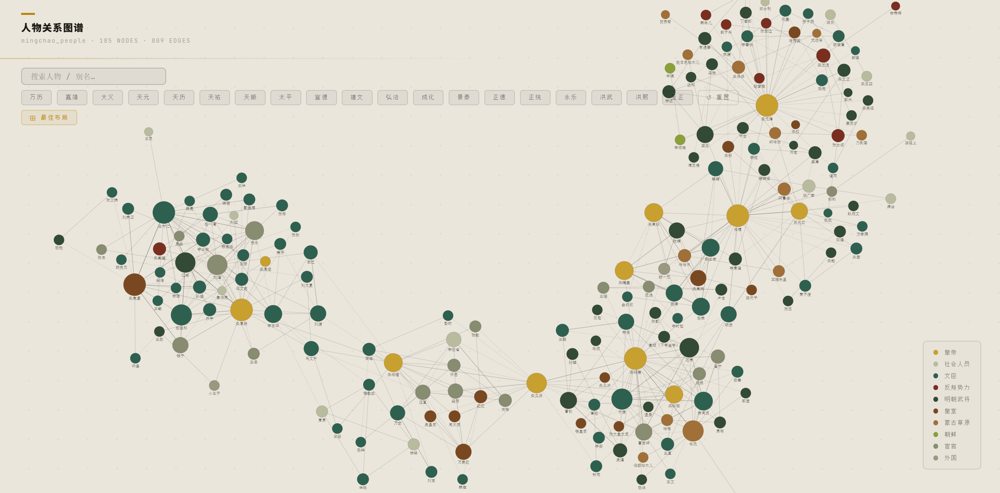
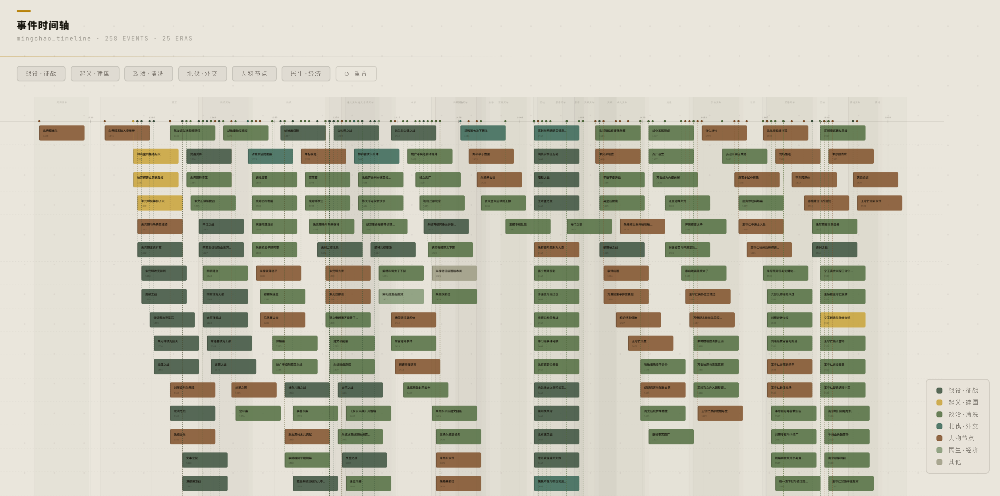
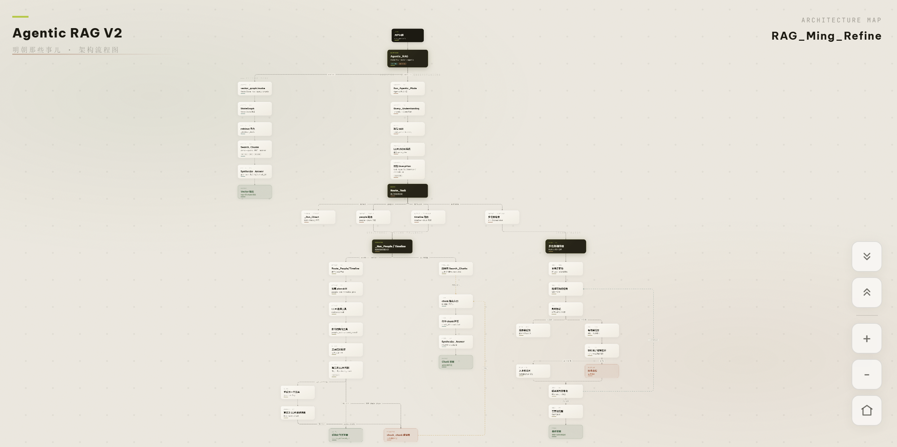
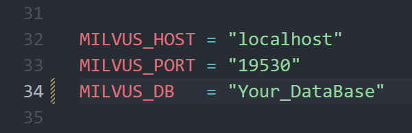
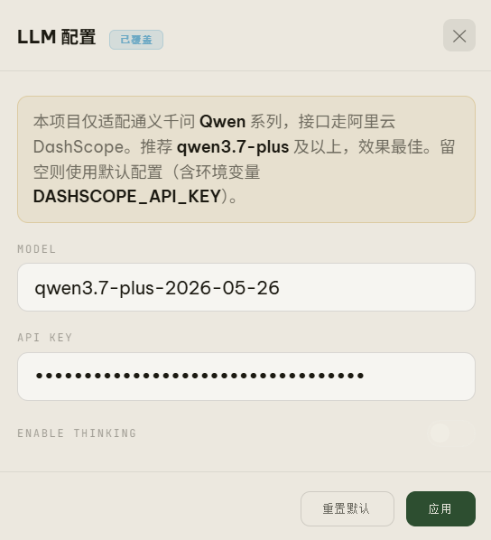
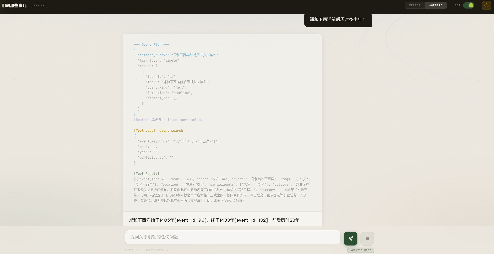

# Mingchao Agentic RAG  项目总览 & 快速启动

本项目为基于小说《明朝那些事儿》前三卷内容构建的 **Agentic RAG 系统**，目标是**召回覆盖绝大多数纯向量检索无法处理的问题类型**，**包括但不限于**枚举（明朝有哪些开国功臣封了公爵）、依赖（先查出一批事件，再逐项追问各自的核心人物）、指代（「他的儿子是谁」中的多轮指代还原）等等。项目有完整的前端本地网页，也可以使用  [`Agentic_RAG_Test.ipynb`](Agentic_RAG_Test.ipynb)  进行代码运行测试。

本项目从开始设计到完成历时两个月有余，期间踩过许多坑，进行过无数次设计优化，有着许多巧思设计，非常感谢您愿意花时间阅读！

[Mingchao Agentic RAG  项目总览 & 快速启动](#mingchao-agentic-rag-项目总览-快速启动)

- [项目设计速览](#项目设计速览)
- [完整交互式流程图](#完整交互式流程图)
- **[快速启动](#快速启动)**
  - [方式一：手动运行以下所有命令](#方式一手动运行以下所有命令)
  - [方式二：Coding Agent 一句话搞定](#方式二coding-agent-一句话搞定)
- **[快速卸载](#快速卸载)**
- [项目文件目录结构](#项目文件目录结构)
- [License](#license)

## 项目设计速览

> [!TIP]
>
> **❗️以下所有速览的详细内容请见 [`Project_Guide.md`](Project_Guide.md)，包括但不限于完整的设计思路，踩坑总结，以及对应优化等。**

- **双模式**：

  - `Vector` 为纯代码检索路径，无 LLM 调用，不读对话历史，拥有极低延迟。

  - `Agentic` 在检索前执行意图识别与问题拆解，由 LLM 负责规划，代码负责校验与执行编排。

- **向量知识库**：《明朝那些事儿》原文按语义边界切分后，以 **BGE-M3** 做 **dense + sparse** 双路编码存入 **Milvus**（支持 Milvus Lite & Docker 双版本），检索时 **RRF** 融合后以 **reranker 精排**。

- **结构化知识图谱**：人物关系和时间线事件以 JSON 图谱独立存储，针对结构化查询比向量检索更精确的场景（人名别名映射、年号顺序比较等）走专用工具，而非统一交给向量相似度。

  
  
  > [!TIP]
  >
  > 知识图谱均有交互式可视化，所有节点均可点击查看详情：
  >
  > - **人物关系图谱**：[`output/mingchao_people_graph/mingchao_people.html`](output/mingchao_people_graph/mingchao_people.html)
  > - **时间线事件图谱**：[`output/mingchao_timeline/mingchao_timeline.html`](output/mingchao_timeline/mingchao_timeline.html)

  
  
  


- **意图识别与问题分类**：Query Understanding Node 将问题归入六大类型（实体关系、时序事件、场景描述、因果分析、子任务拆分、闲聊感叹），决定后续路由走向。

- **复合提问的子任务拆解与编排**：复合问题（例如 “请说出明朝权势滔天的太监以及各自的结局如何” ）拆解为带 `depends_on` 依赖关系的子任务列表，由 Python 拓扑调度器按轮次执行。无依赖任务并行发出；有依赖任务等上游答案入池后，由 LLM 做指代还原与枚举展开，将单个子任务裂变为 N 条具体查询并发执行，结果统一聚合至父任务证据池。

- **工具调用与向量库查询兜底**：人物和时间线路由各有专用检索工具，LLM 通过 native tool call 选择并填写参数。工具结果不足时调用 `check_chunk` 信号触发兜底，并行运行的 chunk 副线程此时已就绪，无额外等待。

- **提示词约束与代码约束的边界划定**：整套系统对 LLM 的决策空间做了有意识的压缩，LLM 被允许做的事只有：

  - 选择调用哪个工具
  - 填写调用工具的参数。
  - 根据工具返回的结果生成回答

  选择工具由 **skills 约束**，参数填写则由代码侧做强校验（参数字段类型，JSON schema 等**均在代码层验证，与 LLM 完全物理隔离**）。LLM 在整条链路中的职责严格限定在它真正擅长的部分，也即理解自然语言问题、做意图归类、从工具返回的非结构化文本中提炼答案。本项目**避免将过多工具调用与参数填写的决策权交给提示词驱动的 LLM** ，防止其一步填错后续无法召回。

- **评估体系**：两种模式分别有独立评测。

  - Vector 模式以 **Recall@1/3/5/10** 和 **NDCG@10** 衡量检索质量（**未采用 MRR**，因 MRR 只追踪第一个相关结果的位置，无法反映多个ground truth chunk 的整体排名质量，而 RAG 场景需要 top-k 内多个相关 chunk 都尽量靠前）

  - Agentic 模式先批量生成答案，再以 LLM 根据专门的评估 skill 做 0/1 二元打分，覆盖准确性与引用完整性。

- **幻觉评估**：针对知识库只覆盖前三卷的边界，测试集问题均出自《明朝那些事儿》后半部分内容，验证模型在工具返回空结果或返回不完整时，**是否能克制先验知识如实作答**。


---


## 完整交互式流程图

> [!TIP]
>
> 本项目拥有**完整交互式可视化架构图**：[`output/flowchart.html`](output/flowchart.html)，每个节点均可点击查看详情。




---


## **快速启动**

> **环境要求**

- Python 3.10 或以上
- 约 7GB 磁盘空间放模型（bge-m3 与 reranker 共约 6.5GB）
- 支持 Windows(WSL) / Linux / macOS，硬件按 **CUDA → Apple MPS → CPU** 逐级退行，无显卡也能跑。
- **Windows 用户请在 WSL 内运行**，Milvus Lite 仅支持 Linux 与 macOS
- 启动新建的环境固定叫 `mingchao_rag`，与你已有的任何环境隔离。


> [!TIP]
>
> **Milvus 默认走 Lite，Windows 系统不支持，需切换 WSL**。
>
> **走 Docker 的话则支持原生 Windows**，如有需要请在 [`rag/config/settings.py`](rag/config/settings.py) 第28行把 `MILVUS_MODE` 改为 `"docker"` 即可。 原生不支持 Milvus Lite，请在 WSL 内运行。


### 方式一：手动运行以下所有命令

> **获取完整项目文件**

使用命令行 clone（推荐）：

```bash
# 先 cd 到你想放的目录，例：
# cd ~/projects             # Linux / macOS
# cd /mnt/d/               # Windows D:\ 盘（WSL 下路径写法）

git clone https://github.com/DawnofeL/Mingchao_Agentic_RAG.git

# 进入项目目录
cd Mingchao_Agentic_RAG
```

或在 GitHub 页面点「Code → Download ZIP」，解压后文件夹名为 `Mingchao_Agentic_RAG-main`，同样需要 cd 进去：

```bash
cd /<你解压到的目录>/Mingchao_Agentic_RAG-main
```


> **新建独立环境**

```bash
# 没有 conda 的话先去 https://www.anaconda.com 下载安装
conda create -n mingchao_rag python=3.10 -y
conda activate mingchao_rag

# 或用 venv 替代（推荐 Python 3.13，即本项目开发版本）：
#   python -m venv .venv && source .venv/bin/activate   # Linux / macOS
#   python -m venv .venv && .venv\Scripts\activate      # Windows
```

```bash
# 按电脑硬件装 torch，三选一
pip install torch --index-url https://download.pytorch.org/whl/cu126   # NVIDIA 显卡
pip install torch                                                      # Apple Silicon（MPS）
pip install torch --index-url https://download.pytorch.org/whl/cpu     # 无 GPU 的 CPU 兜底
```

```bash
# 安装其余依赖
pip install -r requirements.txt

# 下载模型到 model/
python -m pip install -U huggingface_hub
hf download BAAI/bge-m3 --local-dir model/BAAI_bge-m3
hf download BAAI/bge-reranker-v2-m3 --local-dir model/BAAI_bge-reranker-v2-m3
```


> **运行本地网页**

```bash
# 启动（自动打开 http://localhost:8000）
python app.py
```


> [!NOTE]
> **API key 与 Qwen 模型选择**：启动后在网页右上角配置面板填写，或在 notebook [`Agentic_RAG_Test.ipynb`](Agentic_RAG_Test.ipynb) 里的 cell28 调用 `set_llm_override(api_key=...)`。
>
> **如果 Milvus 使用 Docker 版本**，则需要去 `\rag\config\settings.py` 的 line34 将 MILVUS_DB 改为你在 Notebook 里调用 `Insert_json_Into_Milvus_Collection()` 函数创建的 DataBase 名称。 
>
> 


---


### 方式二：Coding Agent 一句话搞定

在 Claude Code / Cursor / Codex / Windsurf 等 AI Agent 里，直接把下面这句话发给它：

```
读取 `https://raw.githubusercontent.com/DawnofeL/Mingchao_Agentic_RAG/main/INSTALL.md` 并严格按步骤完成安装，包括最后直接启动项目。
```

它会读 [INSTALL.md](INSTALL.md) 按步骤自动完成，包括询问你项目放哪里、检测平台和显卡等。

> [!NOTE]
> API key 启动后在网页右上角配置面板填写，安装过程不涉及。


---


### API 与模型配置

启动本地网页后，先点击右上角齿轮按钮打开配置面板，在这里填写 API key，并选择要使用的 Qwen 模型。



配置完成后，就可以在页面底部输入栏里输入问题并发送，系统会以流式输出的方式逐步返回答案。同时右上角可以选择开关 COT 思维链，若关闭则不会打印推理日志，默认为开启状态。




---


## **快速卸载**

**彻底删除本项目新建的一切，不影响本机其他任何东西**。

- 使用方式二的用户请直接告诉 agent「卸载」，它会自动执行。
- 手动用户把下面的 `/<项目所在目录>/to/Mingchao_Agentic_RAG` 替换成实际路径后运行：

```bash
conda deactivate
conda env remove -n mingchao_rag -y
rm -rf <项目所在目录>/Mingchao_Agentic_RAG        # clone 下来的文件夹名
rm -rf <项目所在目录>/Mingchao_Agentic_RAG-main   # ZIP 解压的文件夹名
rm -rf ~/.cache/huggingface
```


---


## 项目文件目录结构

整个仓库按职责分层：

- [`data/`](data/)：原文、chunk、向量、人物 / 时间线知识图谱与评测题库等全部数据资产
- [`rag/`](rag/)：可 import 的运行时代码，含双模式入口、LangGraph 图与检索组件
- [`tools/`](tools/)：离线数据预处理工具（PDF 切分、向量化、Milvus 导入）
- [`eval/`](eval/) & [`skills/`](skills/)：评测与建库代码，以及对应的 Claude Code 技能
- [`server/`](server/) & [`web/`](web/)：FastAPI 后端与静态前端，构成完整 app
- [`output/`](output/)：可视化产物与评测报告
- [`Project_Guide.md`](Project_Guide.md) & [`img/`](img/)：项目文档与配图（根目录，方便直接找到）

下面目录树里用 📂 标已展开（子节点全部列出）的文件夹，▸📂 标未展开的文件夹（内部还有内容，但为了树不至于过长没有展开，比如 [`img/`](img/)），📃 标文件，方便一眼区分。

```text
Mingchao_Agentic_RAG/
├── 📂 data/                                                  # 全部数据资产，按生命周期拆分
│   ├── 📂 eval_qna/                                          # 评测题库
│   │   ├── 📂 chunk_search/                                  # 向量检索题库
│   │   │   └── 📃 chunk_eval_140.json                        # 140 道 chunk 检索评测题
│   │   ├── ▸📂 hallu_test/                                    # 幻觉测试
│   │   ├── ▸📂 people/                                        # 人物题库测试
│   │   ├── ▸📂 timeline/                                      # 事件时间线题库测试
│   │   └── ▸📂 vector_mode/                                   # 纯chunk召回题库（因果分析，描述类）
│   ├── ▸📂 mingchao_json/                                     # 7 卷明朝那些事儿原文 JSON
│   ├── ▸📂 mingchao_pdf/                                      # 7 卷分册 PDF + 合并版 PDF
│   ├── 📂 people_timeline/                                   # 人物与时间线结构化知识图谱
│   │   ├── 📃 mingchao_people.json                           # 人物关系图谱数据
│   │   └── 📃 mingchao_timeline.json                         # 时间线事件图谱数据
│   ├── 📂 raw/                                               # 原始 chunk 与向量数据，运行时不改写
│   │   ├── 📃 mingchao_chunks.json                           # 二级切分后的 chunk
│   │   └── 📃 mingchao_vectorized_1_661.json                 # 导入 Milvus 的数据库
│   ├── 📃 Ming_Dynasty.json                                  # Milvus Collection schema
│   └── 📃 milvus_lite.db                                     # Milvus Lite 本地向量库
├── 📂 model/                                                 # 本地模型权重（首次运行自动下载）
│   ├── ▸📂 BAAI_bge-m3/                                       # BGE-M3 encoder，dense + sparse
│   └── ▸📂 BAAI_bge-reranker-v2-m3/                           # BGE reranker，RRF 候选精排
├── 📂 eval/                                                  # 评测模块
│   ├── 📂 agentic_eval/                                      # agentic rag 结果生成
│   │   └── 📃 agentic_results.py                             # 批量生成 TestResults JSON
│   ├── 📂 kg_visual/                                         # 知识图谱可视化
│   │   ├── 📃 people_graph.py                                # 人物关系图谱 HTML 生成
│   │   └── 📃 timeline_visual.py                             # 时间线图谱 HTML 生成
│   ├── 📂 llm_evaluation/                                    # LLM 打分评测
│   │   ├── 📃 llm_eval.py                                    # LLM 评分主逻辑
│   │   └── 📂 report/                                        # HTML 报告生成
│   │       ├── 📃 components.py                              # 报告组件
│   │       ├── 📃 html_writer.py                             # HTML 拼装与落盘
│   │       ├── 📃 script.py                                  # 报告交互脚本
│   │       └── 📃 styles.py                                  # 报告样式
│   └── 📂 vector_eval/                                       # 向量检索指标评测
│       ├── 📃 aggregator.py                                  # 指标聚合
│       ├── 📃 metrics.py                                     # Recall / NDCG 计算
│       ├── 📃 retrieval_with_stages.py                       # dense / sparse / RRF / rerank
│       ├── 📃 vector_eval.py                                 # 向量评测主逻辑
│       └── 📂 report/                                        # HTML 报告生成
│           ├── 📃 components.py                              # 报告组件
│           ├── 📃 html_writer.py                             # HTML 拼装与落盘
│           ├── 📃 script.py                                  # 报告交互脚本
│           └── 📃 styles.py                                  # 报告样式
├── 📂 output/                                                # 各类评测与可视化输出
│   ├── 📂 embedding_viusal/                                  # 向量分布可视化
│   │   ├── 📃 明朝那些事儿_dense_visual.html                   # dense 向量分布
│   │   └── 📃 明朝那些事儿_sparse_visual.html                  # sparse 向量分布
│   ├── 📃 flowchart.html                                     # 交互式架构流程图
│   ├── 📂 llm_evaluation/                                    # LLM 评分 HTML 报告
│   │   ├── 📃 eval_100_Eval_agentic.html                     # 综合 100 题 agentic 报告
│   │   ├── 📃 eval_100_Eval_vector.html                      # 综合 100 题 vector 报告
│   │   ├── 📃 people_eval_50_Eval_agentic.html               # 人物 agentic 报告
│   │   ├── 📃 people_eval_50_Eval_vector.html                # 人物 vector 报告
│   │   ├── 📃 timeline_eval_50_Eval_agentic.html             # 时间线 agentic 报告
│   │   └── 📃 timeline_eval_50_Eval_vector.html              # 时间线 vector 报告
│   ├── ▸📂 mingchao_people_graph/                             # 人物关系图谱可视化
│   ├── ▸📂 mingchao_timeline/                                 # 时间线图谱可视化
│   └── ▸📂 rag_evaluation/                                    # 向量检索指标（Recall / NDCG）报告
├── 📂 tools/                                                 # 离线数据预处理工具包
│   ├── 📂 pdf_slice/                                         # PDF 解析与分块
│   │   ├── 📃 langchain_recursive_slice.py                   # 二级递归切分（句子级 overlap）
│   │   ├── 📃 ming_volume_slice.py                           # 按卷 / 章 / 节切分原文
│   │   └── 📃 two_level_slice.py                             # 两级切分流程封装
│   ├── 📂 vectorization/                                     # BGE-M3 向量化工具
│   │   └── 📃 vectorization.py                               # dense / sparse 编码并回写 JSON
│   └── 📂 milvus/                                            # Milvus 插入工具（Docker Milvus）
│       └── 📃 milvus.py                                      # 自动建库建表 + 批量插入
├── 📂 rag/                                                   # 可 import 的运行时代码
│   ├── 📂 agent/                                             # 运行模式入口 + LLM skill 提示词
│   │   ├── 📃 rag.py                                         # Agentic_RAG() 分发入口
│   │   ├── 📂 modes/                                         # 模式级编排层
│   │   │   ├── 📃 agentic_mode.py                            # agentic 模式编排
│   │   │   └── 📃 vector_mode.py                             # vector 模式编排
│   │   └── 📂 skills/                                        # 各节点 system prompt
│   │       ├── 📃 final_answer.md                            # 终答合成提示词
│   │       ├── 📃 people_plan.md                             # 人物相关工具使用提示词
│   │       ├── 📃 query_understanding.md                     # 意图识别提示词
│   │       ├── 📃 resolve_references.md                      # 指代还原 / 枚举展开提示词
│   │       └── 📃 timeline_plan.md                           # 时间线相关工具使用提示词
│   ├── 📂 config/                                            # 全局配置
│   │   └── 📃 settings.py                                    # 含 MILVUS_MODE，API key 等配置
│   ├── 📂 graph/                                             # LangGraph 图组装、状态定义等
│   │   ├── 📂 nodes/                                         # 图节点
│   │   │   ├── 📃 orchestrator.py                            # 多任务编排调度器
│   │   │   ├── 📃 query_understanding.py                     # 意图识别节点
│   │   │   ├── 📃 route_people.py                            # 人物路由节点
│   │   │   ├── 📃 route_task.py                              # 任务分发节点
│   │   │   └── 📃 route_timeline.py                          # 时间线路由节点
│   │   ├── 📃 build.py                                       # StateGraph 组装
│   │   ├── 📃 state.py                                       # 状态定义
│   │   └── 📃 stream.py                                      # 流式输出格式化
│   └── 📂 retrieval/                                         # Vector 与 Agentic 代码检索组件
│       ├── 📂 tools/                                         # LLM 可调用的结构化检索工具
│       │   ├── 📃 people_tools.py                            # 人物检索工具 + check_chunk
│       │   └── 📃 timeline_tools.py                          # 时间线检索工具
│       ├── 📃 chunk_rrf.py                                   # dense + sparse + RRF + reranker
│       ├── 📃 milvus_lite_setup.py                           # Milvus Lite 首次建表 + 导入
│       ├── 📃 people_store.py                                # 人物图谱加载与过滤
│       └── 📃 timeline_store.py                              # 时间线图谱加载与过滤
├── 📂 server/                                                # FastAPI 后端
│   ├── 📃 app.py
│   └── 📃 schemas.py                                         # Pydantic 请求 / 响应模型
├── 📂 skills/                                                # 技能集
│   ├── 📂 mingchao_chunk_evaluation/
│   │   ├── 📃 SKILL.md                                       # chunk 检索评测 skill
│   │   ├── 📃 chunk_loader.py
│   │   └── 📃 self_check.py
│   ├── 📂 mingchao_llm_assessment/
│   │   ├── 📃 SKILL.md                                       # LLM 打分 skill
│   │   ├── 📃 extractor.py
│   │   └── 📃 self_check.py
│   ├── 📂 mingchao_orchestrator_evaluation/
│   │   ├── 📃 README.md
│   │   ├── 📃 SKILL.md                                       # 编排器评测 skill
│   │   ├── 📃 orchestrator_loader.py
│   │   └── 📃 self_check.py
│   ├── 📂 mingchao_people_evaluation/
│   │   ├── 📃 SKILL.md                                       # 人物评测 skill
│   │   ├── 📃 people_loader.py
│   │   └── 📃 self_check.py
│   ├── 📂 mingchao_people_timeline_builder/
│   │   ├── 📃 README.md
│   │   ├── 📃 SKILL.md                                       # 知识图谱构建 skill
│   │   └── 📂 scripts/
│   │       ├── 📃 script_chunk_extraction.py
│   │       ├── 📃 script_incremental_merge.py
│   │       └── 📃 validate_kg.py
│   ├── 📂 mingchao_people_timeline_complier/
│   │   ├── 📃 README.md
│   │   ├── 📃 SKILL.md                                       # 知识图谱补全 skill
│   │   └── 📂 scripts/
│   │       ├── 📃 script_find_candidates.py
│   │       └── 📃 validate_kg.py
│   ├── 📂 mingchao_people_timeline_merger/
│   │   ├── 📃 README.md
│   │   ├── 📃 SKILL.md                                       # 知识图谱合并 skill
│   │   └── 📂 scripts/
│   │       ├── 📃 script_extract_keys.py
│   │       └── 📃 script_filter_by_key.py
│   └── 📂 mingchao_timeline_evaluation/
│       ├── 📃 SKILL.md                                       # 时间线评测 skill
│       ├── 📃 self_check.py
│       └── 📃 timeline_loader.py
├── 📂 web/                                                   # 前端
│   ├── 📃 index.html
│   ├── 📃 script.js
│   └── 📃 style.css
├── 📃 Agentic_RAG_Test.ipynb                                 # 交互式测试入口
├── 📃 app.py                                                 # 一键启动入口：python app.py
├── 📃 requirements.txt
├── 📃 LICENSE
├── 📃 Project_Guide.md                                 # 项目速览文档（含全部设计思路与踩坑总结）
├── ▸📂 img/                                                   # 文档配图
└── 📃 README.md
```


---


## License

本项目代码基于 [CC BY-NC 4.0](https://creativecommons.org/licenses/by-nc/4.0/) 协议开源，允许非商业使用与改编，使用时请注明出处。

《明朝那些事儿》语料仅供学习研究使用，原文版权归原著作权人所有。
